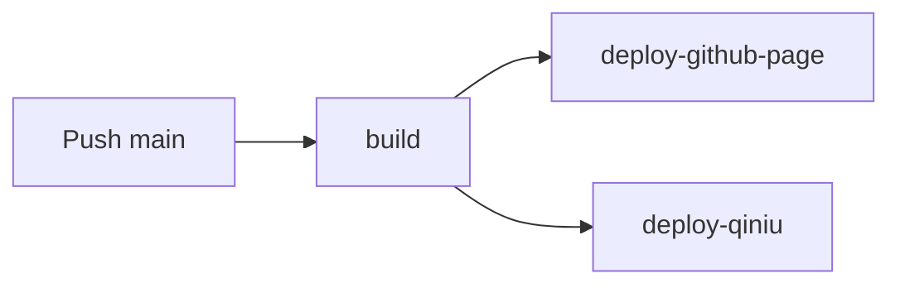

# ほぼろ

[](https://github.com/chen-yixin/chen-yixin.github.io/actions/workflows/build.yml)

个人博客，基于 [Hexo](https://hexo.io/) v8 + [Kratos:Rebirth](https://github.com/kratos-rebirth/quickstart) v3 主题构建。

> 在线地址：[https://www.hoboro.top](https://www.hoboro.top)

## 技术栈

| 组件 | 说明 |
|---|---|
| **Hexo** v8 | 静态站点生成器 |
| **Kratos:Rebirth** v3 | 博客主题 |
| **pnpm** v9 | 包管理器 |
| **Waline** v3 | 评论系统（自托管于 `waline.hoboro.top`） |
| **Mermaid** | 文章内图表渲染 |
| **highlight.js** | 代码语法高亮 |
| **七牛云** | 静态资源 CDN（`img.hoboro.top`） |
| **GitHub Actions** | CI/CD 自动构建部署 |
| **GitHub Pages** | 主站托管 |

## 功能一览

- 🎨 暗色/亮色主题切换，PJAX 无刷新页面加载
- 💬 Waline 评论 + 浏览量统计 + 表情包（Bilibili / Bmoji）
- 📤 QQ / 微博 / X / Facebook 一键分享
- 💰 支付宝 / 微信打赏
- 📊 文章内 Mermaid 图表
- 🌏 代码高亮（highlight.js）
- 📡 RSS / Atom 订阅、Sitemap 站点地图
- 🔤 中文注音（ruby 标记）
- 📐 数学公式（LaTeX）
- 🔍 站内搜索

## 本地开发

### 环境准备

```sh
# 安装 pnpm（如已安装可跳过）
npm install -g pnpm
```

### 启动开发服务器

```sh
# 安装依赖（必须使用 --frozen-lockfile）
pnpm install --frozen-lockfile

# 启动本地预览（http://localhost:4000）
pnpm run server
```

### 构建与清理

```sh
# 构建静态站点
pnpm run build

# 清理构建缓存
pnpm run clean
```

## 写文章

```sh
# 创建新文章（模板：scaffolds/post.md）
npx hexo new "文章标题"

# 创建草稿（模板：scaffolds/draft.md）
npx hexo new draft "草稿标题"

# 发布草稿
npx hexo publish "草稿标题"
```

文章存放在 `source/_posts/` 目录下，可按分类创建子目录（如 `anime/`、`nas/`、`cook/` 等）。

### Front-matter 参考

每篇文章头部支持的字段：

```yaml
---
title: 文章标题          # 必填
date: 2024-01-01 00:00  # 自动生成
categories:              # 分类（数组或字符串）
  - 技术
tags:                    # 标签
  - Hexo
  - 博客
description:             # 文章摘要（SEO）
keywords:                # 关键词（SEO）
sticky: 100             # 置顶（数值越大越靠前）
cover: /path/to/img     # 封面图 URL
comments: true          # 是否开启评论
toc: true               # 是否显示目录
donate: true            # 是否显示打赏
share: true             # 是否显示分享
---
```

> 完整模板见 [`scaffolds/post.md`](scaffolds/post.md)。

## 项目结构

```
├── _config.yml                  # Hexo 主配置（站点、URL、渲染器等）
├── _config.kratos-rebirth.yml   # 主题配置（导航、侧栏、评论、CDN 等）
├── scaffolds/                   # 文章/页面模板
│   ├── post.md                  # 文章模板
│   ├── draft.md                 # 草稿模板
│   └── page.md                  # 独立页面模板
├── source/
│   ├── _posts/                  # 博客文章（按分类分子目录）
│   └── extentions/              # 自定义 JS/CSS 注入
│       ├── waline.js            # Waline 评论初始化
│       ├── waline.css           # Waline 自定义样式
│       └── mermaid.js           # Mermaid 图表初始化
├── upload_qiniu.cjs             # 七牛云上传脚本（CI 使用）
├── sitemap_template.xml         # 自定义 Sitemap 模板
├── .github/workflows/build.yml  # CI/CD 工作流
└── public/                      # 构建输出（gitignored）
```

## 部署

Push 到 `main` 分支后，GitHub Actions 自动执行：



| Job | 操作 |
|---|---|
| **build** | 安装依赖 → `hexo generate --force` → 上传 artifact |
| **deploy-github-page** | 部署 `public/` 到 GitHub Pages |
| **deploy-qiniu** | 上传 `public/` 到七牛云对象存储 + 刷新 CDN 缓存 |

> `_config.yml` 中的 `deploy` 配置为空，实际部署全部由 CI 完成，不使用 `hexo deploy` 命令。

## 链接说明

固定链接格式为 `posts/:title/`，修改此格式会破坏所有已有文章链接，**请勿变更**。

## License

MIT License
