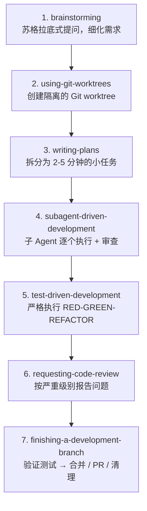
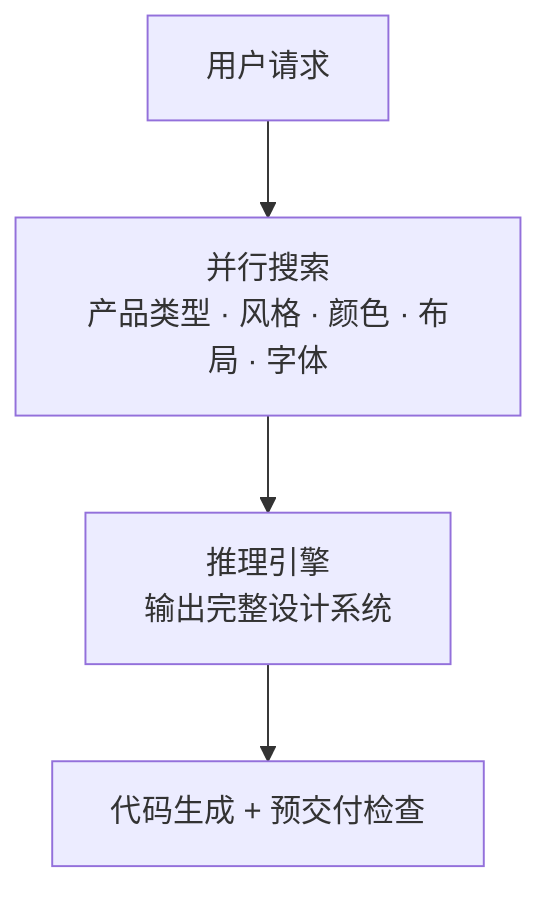

GitHub Copilot 是 GitHub 推出的 AI 编程助手，深度集成于 VS Code 等主流 IDE 和终端。截至 2026 年 5 月，Copilot 已支持多模型切换、Agent 模式、CLI 终端、Skills 插件等丰富功能。

本文面向首次使用者，以 VS Code 为例介绍基本使用、常用命令，以及如何接入 DeepSeek V4、使用 Superpowers 和 UI UX Pro Max 插件。

<!-- more -->

## 基本使用（VS Code）

### 安装与登录

1. 在 VS Code 扩展商店搜索 **GitHub Copilot** 并安装
2. 安装完成后点击左下角账户图标，登录 GitHub 账号
3. 如需付费，在 [GitHub Copilot 设置](https://github.com/settings/copilot) 中开通订阅



- **Free**：每月 2000 次代码补全 + 50 次聊天
- **Pro**：无限补全 + 聊天，$10/月
- **Pro+**：额外支持请求次数更高的模型、BYOK 接入自定义模型
- **Business / Enterprise**：团队管理、策略控制



### 三种工作模式

Copilot Chat 支持三种模式，点击聊天框下方的模式切换按钮：

| 模式      | 图标 | 说明                                                 |
| --------- | ---- | ---------------------------------------------------- |
| **Ask**   | `?`  | 问答模式：解释代码、回答问题，不修改文件             |
| **Edit**  | `✎`  | 编辑模式：针对选中代码进行局部修改                   |
| **Agent** | `A`  | 代理模式：自主规划多步骤任务、读写文件、运行终端命令 |

### 内联代码补全

在编辑器中编写代码时，Copilot 会自动以灰色文字提供补全建议：

- `Tab` — 接受建议
- `Esc` — 拒绝建议
- `Ctrl + Enter` — 查看多个备选建议（在新面板中展示）
- `Alt + ]` / `Alt + [` — 在多个建议之间切换

```javascript
// 写一个函数签名，Copilot 自动补全函数体
function calculateTotal(items) {
  // Copilot 自动补全 ↓
  return items.reduce((sum, item) => sum + item.price * item.qty, 0);
}
```

### Copilot Chat 聊天

**快捷键**：

| 操作           | Windows / Linux    | macOS             |
| -------------- | ------------------ | ----------------- |
| 打开聊天       | `Ctrl + I`         | `Cmd + I`         |
| 内联聊天       | `Ctrl + Shift + I` | `Cmd + Shift + I` |
| 打开聊天侧边栏 | `Ctrl + Alt + I`   | `Cmd + Alt + I`   |

**文件引用**：在聊天中输入 `#` 可以引用当前打开的文件、选中代码、工作区文件，让 Copilot 获取精准上下文。

```
#file:src/auth.ts 解释这个文件中的认证流程
```

**选中代码后右键**，可快速执行：

- Copilot > Explain This（解释代码）
- Copilot > Fix This（修复问题）
- Copilot > Generate Tests（生成测试）
- Copilot > Generate Docs（生成文档）

## 常用命令

### Chat 中的斜杠命令

| 命令       | 功能                   |
| ---------- | ---------------------- |
| `/explain` | 解释所选代码           |
| `/fix`     | 修复所选代码中的问题   |
| `/tests`   | 为所选代码生成单元测试 |
| `/doc`     | 为所选代码添加文档注释 |
| `/clear`   | 清空当前对话           |
| `/new`     | 新建一个聊天会话       |
| `/agent`   | 切换到 Agent 模式      |

### Agent 模式专用命令

| 命令        | 功能                    |
| ----------- | ----------------------- |
| `/delegate` | 委托 Agent 自主完成任务 |
| `/pr`       | 创建和管理 Pull Request |
| `/fleet`    | 并行执行多个任务        |
| `/undo`     | 撤销 Agent 的修改       |

### CLI 命令（终端使用）

在终端中安装 Copilot CLI：

```powershell
# 使用 PowerShell（Windows）
winget install GitHub.Copilot.CLI

# 或使用 npm
npm install -g @github/copilot-cli
```

启动后可直接在终端对话：

```bash
copilot
```

```
copilot> 帮我写一个读取 CSV 并计算平均值的 Python 脚本
```

CLI 模式下的常用命令：

| 命令             | 功能                |
| ---------------- | ------------------- |
| `copilot`        | 启动交互式会话      |
| `copilot "问题"` | 单次问答（非交互）  |
| `/delegate`      | 委托 Agent 自主执行 |
| `/pr`            | 管理 Pull Request   |
| `/fleet`         | 多任务并行执行      |
| `/undo`          | 撤销修改            |

## 接入 DeepSeek V4

根据 [DeepSeek 官方文档](https://api-docs.deepseek.com/zh-cn/quick_start/agent_integrations/github_copilot)，有两种接入方式：通过 VS Code 插件直接集成，或通过 Copilot CLI 配置环境变量。**Free 订阅即可使用**，无需 Pro+。

### 方式一：VS Code 插件（推荐，零门槛）

安装 [DeepSeek V4 for Copilot Chat](https://github.com/Vizards/deepseek-v4-for-copilot) 插件，将 DeepSeek V4 Pro / Flash 直接添加到 Copilot 的模型选择器中。无需替换 Copilot，Agent 模式、工具调用、Skills、MCP 全部保留。



- 在 Copilot Chat 原生的模型选择器中直接选择 DeepSeek
- Agent 模式、工具调用、自定义指令、Skills、MCP **全部可用**
- **视觉支持**：DeepSeek V4 是纯文本模型，但插件会自动通过其他已安装的 Copilot 模型（如 Claude、GPT-4o）描述图片再发给 DeepSeek
- API Key 存储在操作系统密钥链中，**不写入磁盘**
- 支持**思考模式**（None / High / Max），可控制推理深度
- 零运行时依赖，纯 VS Code API + Node.js 内置模块



**步骤 1：安装插件**

- 需 VS Code 1.116 或更高版本
- 确保已安装 GitHub Copilot 并登录（Free / Pro / Enterprise 均可）
- 从 [VS Code Marketplace](https://marketplace.visualstudio.com/items?itemName=Vizards.deepseek-v4-for-copilot) 安装插件（搜索 `deepseek-v4-for-copilot`）

**步骤 2：获取 DeepSeek API Key**

前往 [DeepSeek 开放平台](https://platform.deepseek.com/api_keys) 创建 API Key（以 `sk-` 开头）。

**步骤 3：配置 API Key**

打开 VS Code 命令面板（`Ctrl+Shift+P`），执行 **DeepSeek: Set API Key**，粘贴 Key。Key 安全存储在操作系统密钥链中。

**步骤 4：选择模型并开始使用**

打开 Copilot Chat（`Ctrl+Shift+I`），点击模型选择器，选择 **DeepSeek V4 Pro** 或 **DeepSeek V4 Flash**。即可正常使用，Agent 模式、工具调用等功能全部由 DeepSeek 驱动。

| 模型 | 适用场景 |
| --- | --- |
| **DeepSeek V4 Flash** | 日常快速编码、快速编辑、低成本迭代 |
| **DeepSeek V4 Pro** | 复杂重构、Agent 任务、深度推理 |

**可选：配置思考深度**

在模型选择器中点击 DeepSeek 模型旁的齿轮图标：

| 模式 | 说明 |
| --- | --- |
| **None** | 最快，不启用推理 |
| **High** | 平衡模式（默认） |
| **Max** | 深度推理，适合复杂任务 |

**可选：配置视觉代理模型**

执行命令 **DeepSeek: Set Vision Proxy Model**，选择用于图片描述的 Copilot 模型。将截图拖入聊天框后，插件会自动描述图片内容再发送给 DeepSeek。

### 方式二：Copilot CLI（命令终端）

通过 BYOK 模式在终端中使用 DeepSeek。**关键**：必须使用 `anthropic` 提供者类型（而非 `openai`）。



使用 `openai` 类型会触发 400 错误：`The reasoning_content in the thinking mode must be passed back to the API.` — DeepSeek 的思考模式要求将模型输出的 `reasoning_content` 在下一次请求中原样回传，Copilot CLI 的 OpenAI 集成不支持此机制。改用 Anthropic Messages API 端点可完全避免此问题。



**步骤 1：安装 Copilot CLI**

```powershell
npm install -g @github/copilot
```

需要 Node.js 22 或更高版本。

**步骤 2：获取 API Key**

同上，前往 [DeepSeek 开放平台](https://platform.deepseek.com/api_keys) 创建。

**步骤 3：配置环境变量（PowerShell）**

```powershell
# 核心三项（必须）
$env:COPILOT_PROVIDER_TYPE        = "anthropic"
$env:COPILOT_PROVIDER_BASE_URL    = "https://api.deepseek.com/anthropic"
$env:COPILOT_PROVIDER_API_KEY     = "sk-你的DeepSeek_API_Key"
$env:COPILOT_MODEL                = "deepseek-v4-pro"

# Token 限制（推荐配置）
$env:COPILOT_PROVIDER_MAX_PROMPT_TOKENS  = "840000"
$env:COPILOT_PROVIDER_MAX_OUTPUT_TOKENS  = "128000"
```

永久设置（推荐）：

```powershell
[Environment]::SetEnvironmentVariable("COPILOT_PROVIDER_TYPE", "anthropic", "User")
[Environment]::SetEnvironmentVariable("COPILOT_PROVIDER_BASE_URL", "https://api.deepseek.com/anthropic", "User")
[Environment]::SetEnvironmentVariable("COPILOT_PROVIDER_API_KEY", "sk-你的API_Key", "User")
[Environment]::SetEnvironmentVariable("COPILOT_MODEL", "deepseek-v4-pro", "User")
[Environment]::SetEnvironmentVariable("COPILOT_PROVIDER_MAX_PROMPT_TOKENS", "840000", "User")
[Environment]::SetEnvironmentVariable("COPILOT_PROVIDER_MAX_OUTPUT_TOKENS", "128000", "User")
```

> 由于 `deepseek-v4-pro` 不在 Copilot CLI 的内置模型目录中，需要显式配置 token 限制，否则可能因上下文超限出错。

**步骤 4：启动**

```bash
copilot
```

Agent 模式、工具调用、MCP 全部由 DeepSeek 驱动。

**可选：离线模式**

阻止 Copilot CLI 连接 GitHub 服务器（提示词仍发送到 DeepSeek）：

```powershell
$env:COPILOT_OFFLINE = "true"
```

**切换模型**：修改 `COPILOT_MODEL` 为 `deepseek-v4-flash` 即可切换到 Flash 模型。运行 `copilot help providers` 可查看所有可用环境变量。

## 使用 Superpowers

[Superpowers](https://github.com/obra/superpowers) 是一套 204K+ Star 的 AI 代理开发方法论，已在 Copilot CLI 上原生支持。

### 安装

**Copilot CLI**：

```bash
copilot plugin marketplace add obra/superpowers-marketplace
copilot plugin install superpowers@superpowers-marketplace
```

安装后，Superpowers 的 15+ 个 Skills 会自动注册到 Copilot 的工作流中，无需手动激活。

### Superpowers 工作流



### 实际使用

安装 Superpowers 后，在使用 Copilot CLI 时会自动触发。例如：

```
copilot> 帮我给这个项目添加用户认证功能
```

Copilot 不会直接写代码，而是先进行 `brainstorming`：

- 询问你想要的认证方式（JWT？Session？OAuth？）
- 确认技术栈和约束条件
- 展示设计方案供你确认

然后自动创建 Git worktree，编写详细实施计划，再逐任务执行。整个过程无需手动调用 Skill，全自动流转。

## 使用 UI UX Pro Max

[UI UX Pro Max](https://github.com/nextlevelbuilder/ui-ux-pro-max-skill) 是一个 82K+ Star 的 UI/UX 设计智能 Skill，提供 161 条推理规则、67 种 UI 风格、161 套配色方案。

### 安装

通过 CLI 工具一键安装：

```bash
npm install -g uipro-cli
cd /path/to/project
uipro init --ai copilot
```

安装完成后，当你在对话中提出 UI/UX 相关请求时，Skill 会自动激活。也可以使用斜杠命令显式调用：

```
/ui-ux-pro-max 为我的 SaaS 产品设计一个落地页
```

### 实际使用



**示例对话**：

```
copilot> 帮我做一个医疗健康数据分析仪表盘，要暗色主题
```

Copilot 结合 UI UX Pro Max 会自动：

1. 分析"医疗健康仪表盘"的产品类型
2. 推荐合适的 UI 风格（数据密集型仪表盘风格）
3. 生成配色方案（暗色主题 + 医疗行业配色）
4. 输出可直接运行的代码（React + Tailwind / HTML 等）

### 技术栈支持

UI UX Pro Max 支持 15 种技术栈，在提示词中指定即可：

| 类别   | 支持的技术栈                                                          |
| ------ | --------------------------------------------------------------------- |
| Web    | HTML + Tailwind、React、Next.js、Vue、Nuxt.js、Svelte、Astro、Angular |
| UI 库  | shadcn/ui、Nuxt UI                                                    |
| 移动端 | React Native、Flutter、SwiftUI、Jetpack Compose                       |
| PHP    | Laravel                                                               |

```
/ui-ux-pro-max 用 React + Tailwind 做一个暗色金融仪表盘
```

## 最佳实践

### 提供充足的上下文

```
#file:src/components/UserList.tsx
参考这个组件的写法，帮我创建一个类似的 ProductList 组件
```

### 用 @ 引用工作区文件

在聊天中 `@` + 模糊搜索文件名，让 Copilot 精确理解你的代码：

```
@UserService.ts 修改 getUserById 方法，添加缓存逻辑
```

### 善用 Agent 模式做复杂任务

```
切换到 Agent 模式：
帮我把项目中所有的 console.log 替换成统一的 logger 调用，然后生成一个 commit
```

Agent 模式会自主：搜索文件 → 替换代码 → 运行测试 → 提交 commit。

### 自定义指令

在 VS Code 中配置 `.github/copilot-instructions.md` 或设置面板中的 "Custom Instructions"，让 Copilot 遵循项目约定：

```markdown
# copilot-instructions.md

- 使用 TypeScript 严格模式
- 所有函数必须有 JSDoc 注释
- 组件使用函数式写法，不要 class component
- 样式用 Tailwind CSS，不要单独 CSS 文件
- 测试用 Vitest，文件命名 \*.test.ts
```

### Copilot Memory

Copilot 支持跨会话记忆：

- **用户级别偏好**：记住你的代码风格、常用技术栈
- **仓库级别事实**：记住项目架构、关键约定

可在 [GitHub Settings > Copilot](https://github.com/settings/copilot) 中管理记忆内容。

## 与其他 AI 助手对比

| 特性        | GitHub Copilot              | OpenCode          | Cursor         |
| ----------- | --------------------------- | ----------------- | -------------- |
| IDE 集成    | VS Code / JetBrains / Xcode | 终端 / 桌面 / IDE | 独立 IDE       |
| 代码补全    | 最强                        | 无（靠 Agent）    | 支持           |
| Agent 模式  | 支持                        | 支持              | 支持           |
| 模型切换    | 内置 + BYOK                 | 75+ 提供商        | 有限           |
| CLI 终端    | Copilot CLI                 | 原生 TUI          | CLI 较弱       |
| Skills 插件 | 支持                        | 支持              | 支持           |
| PR 管理     | 原生集成                    | 需 MCP 扩展       | 无             |
| 定价        | Free / Pro $10 / Pro+       | 免费开源          | Free / Pro $20 |

## 参考链接

- [GitHub Copilot 官方文档](https://docs.github.com/en/copilot)
- [VS Code Copilot 指南](https://code.visualstudio.com/docs/copilot/overview)
- [Copilot CLI](https://docs.github.com/en/copilot/how-tos/copilot-cli)
- [Copilot 支持的 AI 模型](https://docs.github.com/en/copilot/using-github-copilot/ai-models/supported-ai-models-in-copilot)
- [DeepSeek 开放平台](https://platform.deepseek.com/)
- [Superpowers](https://github.com/obra/superpowers)
- [UI UX Pro Max](https://github.com/nextlevelbuilder/ui-ux-pro-max-skill)
