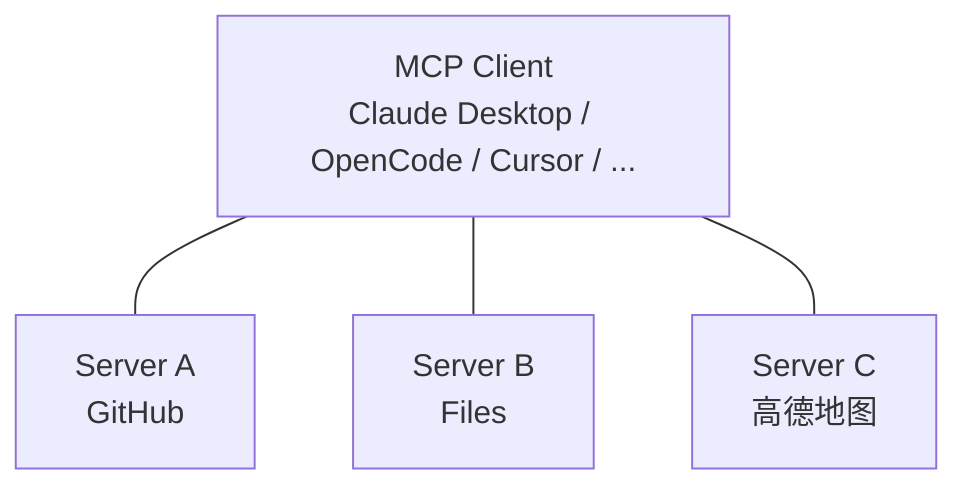

MCP（Model Context Protocol，模型上下文协议）是 Anthropic 发起、现由 Linux 基金会托管的开放协议，为 LLM 与外部工具、数据源之间提供标准化的连接方式。截至 2026 年 5 月，MCP 生态已拥有 86K+ Star 的官方 Servers 仓库、10 种语言的 SDK，以及数千个社区开发的服务器。

本文介绍 MCP 的核心概念、在 OpenCode 中的配置方法，并以高德地图 MCP Server 为例进行实战演示。

<!-- more -->

## 什么是 MCP

在 MCP 出现之前，每个 AI 应用都需要为每个外部工具单独编写集成代码——A 应用接 GitHub 是一套，B 应用接 GitHub 是另一套，互不通用。

MCP 解决的核心问题是：**一次编写，到处使用**。任何实现了 MCP 协议的 Server，可以被任何 MCP 客户端（Claude Desktop、OpenCode、Cursor 等）直接使用。





MCP Server 通过以下三种原语暴露能力：

- **Tools**：模型可调用的函数（如搜索 POI、查询天气、读取文件）
- **Resources**：模型可读取的结构化数据（如数据库 schema、文件内容）
- **Prompts**：预定义的提示词模板



## MCP 的三种传输方式

| 传输方式            | 说明                                              | 适用场景           |
| ------------------- | ------------------------------------------------- | ------------------ |
| **stdio**           | 通过标准输入/输出通信，客户端直接启动 Server 进程 | 本地开发，最简单   |
| **SSE**             | Server-Sent Events，HTTP 长连接推送               | 远程部署，实时推送 |
| **Streamable HTTP** | 基于 HTTP 的流式传输                              | 远程部署，更灵活   |

## 在 OpenCode 中配置 MCP

### 本地 MCP Server

在 `opencode.json` 中配置，通过 `command` 指定启动命令：

```json
{
  "$schema": "https://opencode.ai/config.json",
  "mcp": {
    "my-local-server": {
      "type": "local",
      "command": [
        "npx",
        "-y",
        "@modelcontextprotocol/server-filesystem",
        "/path/to/allowed"
      ],
      "enabled": true,
      "environment": {
        "MY_API_KEY": "your-key"
      }
    }
  }
}
```



Windows 下 npx 等命令需包裹 `cmd /c`：

```json
"command": ["cmd", "/c", "npx", "-y", "my-mcp-command"]
```

如果使用 `uvx`（Python MCP Server），则无需此包裹。



### 远程 MCP Server

通过 URL 连接远程服务：

```json
{
  "mcp": {
    "context7": {
      "type": "remote",
      "url": "https://mcp.context7.com/mcp",
      "headers": {
        "CONTEXT7_API_KEY": "{env:CONTEXT7_API_KEY}"
      }
    }
  }
}
```

### OAuth 认证

部分远程 MCP Server 需要 OAuth 授权：

```bash
opencode mcp auth <server-name>
```

浏览器会自动打开完成授权流程，令牌存储在 `~/.local/share/opencode/mcp-auth.json`。

### 工具级权限控制

MCP 暴露的工具可以和内置工具一样进行权限管理：

```json
{
  "tools": {
    "my-mcp*": "ask",
    "dangerous-tool": false
  }
}
```



每个 MCP Server 的工具描述都会占用模型上下文。启用过多 MCP Server（尤其是 GitHub MCP 这类工具数量庞大的）容易超出上下文限制。建议按需启用。



## 实战：高德地图 MCP Server

### 简介

[amap-mcp-server](https://github.com/sugarforever/amap-mcp-server) 是一个基于高德地图 API 的 Python MCP Server，支持 stdio、SSE 和 Streamable HTTP 三种传输方式。提供 15+ 个工具，涵盖地理编码、路线规划、POI 搜索、天气查询等。

### 准备工作

1. 前往[高德开放平台](https://lbs.amap.com/)注册并创建应用
2. 在"应用管理"页面获取 API Key（选择 Web 服务类型）
3. 安装 uv（Python 包管理工具）：

```bash
# Windows
powershell -c "irm https://astral.sh/uv/install.ps1 | iex"

# macOS / Linux
curl -LsSf https://astral.sh/uv/install.sh | sh
```

### 在 OpenCode 中配置

在项目 `opencode.json` 中添加：

```json
{
  "$schema": "https://opencode.ai/config.json",
  "mcp": {
    "amap": {
      "type": "local",
      "command": ["uvx", "amap-mcp-server"],
      "enabled": true,
      "environment": {
        "AMAP_MAPS_API_KEY": "你的高德API Key"
      }
    }
  }
}
```

### 可用工具一览

**地理编码：**

| 工具               | 功能                               |
| ------------------ | ---------------------------------- |
| `maps_regeocode`   | 经纬度 -> 结构化地址（逆地理编码） |
| `maps_geo`         | 结构化地址 -> 经纬度（地理编码）   |
| `maps_ip_location` | IP 地址定位                        |

**路线规划：**

| 工具                                | 功能                 |
| ----------------------------------- | -------------------- |
| `maps_direction_driving`            | 驾车路线规划         |
| `maps_direction_walking`            | 步行路线规划         |
| `maps_bicycling`                    | 骑行路线规划         |
| `maps_direction_transit_integrated` | 公交换乘路线（跨城） |
| `maps_distance`                     | 两点距离测量         |

**POI 与天气：**

| 工具                 | 功能             |
| -------------------- | ---------------- |
| `maps_text_search`   | 关键字搜索 POI   |
| `maps_around_search` | 周边 POI 搜索    |
| `maps_search_detail` | POI 详细信息查询 |
| `maps_weather`       | 城市天气查询     |

### 使用示例

配置完成后，直接在 OpenCode 对话中使用：

**场景一：出行规划**

```
帮我查一下从"北京朝阳区阜通东大街6号"到"北京海淀区上地十街10号"怎么走？公交和驾车都告诉我。
```

Agent 自动调用 `maps_direction_driving_by_address` 和 `maps_direction_transit_integrated_by_address` 两个工具，返回完整的路线方案。

**场景二：周边搜索**

```
我在杭州西湖边上（120.15, 30.25），帮我找找附近 2 公里内有什么好吃的餐厅。
```

Agent 调用 `maps_around_search`，传入坐标和 `keywords: "餐厅"`。

**场景三：天气查询**

```
查一下深圳明天天气如何。
```

Agent 调用 `maps_weather` 获取天气数据。

**场景四：多工具组合**

```
我打算从上海坐高铁去南京玩，
帮我查一下：
1. 上海到南京的驾车距离
2. 夫子庙附近有什么酒店
3. 南京明天的天气
```

Agent 依次调用 `maps_geo`（解析"夫子庙"坐标）、`maps_distance`（驾车距离）、`maps_around_search`（夫子庙周边酒店）、`maps_weather`（南京天气）。

### SSE 模式（远程部署）

如果需要在远程服务器上运行，可以使用 SSE 模式：

```bash
export AMAP_MAPS_API_KEY=你的API Key
uvx amap-mcp-server sse
```

客户端配置：

```json
{
  "mcp": {
    "amap": {
      "type": "remote",
      "url": "http://your-server:8000/sse"
    }
  }
}
```

### Streamable HTTP 模式

```bash
export AMAP_MAPS_API_KEY=你的API Key
uvx amap-mcp-server streamable-http
```

```json
{
  "mcp": {
    "amap": {
      "type": "remote",
      "url": "http://your-server:8000/mcp"
    }
  }
}
```

## 官方参考 MCP Server

MCP 官方维护了一批参考实现，涵盖常见场景：

| Server                  | 功能                           | 启动方式                                                  |
| ----------------------- | ------------------------------ | --------------------------------------------------------- |
| **Filesystem**          | 安全的文件读写，支持路径白名单 | `npx -y @modelcontextprotocol/server-filesystem <path>`   |
| **Git**                 | Git 仓库读取、搜索、操作       | `uvx mcp-server-git --repository <path>`                  |
| **Memory**              | 基于知识图谱的持久化记忆系统   | `npx -y @modelcontextprotocol/server-memory`              |
| **Fetch**               | 网页内容抓取与转换             | `uvx mcp-server-fetch`                                    |
| **Sequential Thinking** | 动态多步推理                   | `npx -y @modelcontextprotocol/server-sequential-thinking` |
| **Time**                | 时间与时区转换                 | `uvx mcp-server-time`                                     |

### Filesystem 示例

让 AI 能安全地读写指定目录：

```json
{
  "mcp": {
    "filesystem": {
      "type": "local",
      "command": [
        "npx",
        "-y",
        "@modelcontextprotocol/server-filesystem",
        "/Users/me/projects"
      ],
      "enabled": true
    }
  }
}
```

```
帮我看看 /Users/me/projects/my-app/package.json 里有哪些依赖需要升级
```

### Memory 示例

跨会话保持上下文：

```json
{
  "mcp": {
    "memory": {
      "type": "local",
      "command": ["npx", "-y", "@modelcontextprotocol/server-memory"]
    }
  }
}
```

## 社区热门 MCP Server

| Server                                                                                        | 功能            | 亮点                      |
| --------------------------------------------------------------------------------------------- | --------------- | ------------------------- |
| [Context7](https://github.com/upstash/context7)                                               | 搜索技术文档    | 即时获取最新库/框架用法   |
| [Sentry](https://mcp.sentry.dev)                                                              | 错误监控        | 在对话中排查生产 Bug      |
| [Grep by Vercel](https://grep.app)                                                            | GitHub 代码搜索 | 快速找代码示例            |
| [Puppeteer](https://github.com/modelcontextprotocol/servers-archived/tree/main/src/puppeteer) | 浏览器自动化    | 截图、爬取动态页面        |
| [Brave Search](https://github.com/brave/brave-search-mcp-server)                              | 网页搜索        | 补充 LLM 训练截止后的信息 |

> 更多 MCP Server 可以在 [MCP Registry](https://registry.modelcontextprotocol.io/) 和 [Smithery](https://smithery.ai/) 上浏览。

## MCP Server 的基本结构

一个最简单的 MCP Server 包含以下要素：

```python
# server.py
from mcp.server.fastmcp import FastMCP

mcp = FastMCP("My Server")

@mcp.tool()
def hello(name: str) -> str:
    """向指定名称问好"""
    return f"你好, {name}!"

if __name__ == "__main__":
    mcp.run()
```

运行：

```bash
uvx --from mcp my_server.py
```

核心要点：

1. **`@mcp.tool()` 装饰器**将普通函数暴露为 MCP Tool
2. **函数签名**自动成为 Tool 的输入 schema（参数类型、描述）
3. **docstring** 自动成为 Tool 的描述，Agent 靠它判断何时调用
4. **三种原语可混合**：一个 Server 可同时提供 Tools、Resources 和 Prompts

## MCP vs Function Calling 对比

| 维度     | MCP                              | 原生 Function Calling |
| -------- | -------------------------------- | --------------------- |
| 通用性   | 一次编写，所有 MCP 客户端可用    | 每个平台单独集成      |
| 发现机制 | 客户端自动发现 Server 的工具列表 | 需手动配置每个函数    |
| 传输方式 | stdio / SSE / Streamable HTTP    | 依赖平台实现          |
| 生态     | 数千个社区 Server 可直接复用     | 各平台各自为战        |
| 认证     | 内置 OAuth 支持                  | 需自行实现            |

## 调试工具

**MCP Inspector**（官方可视化调试工具）：

```bash
npx @modelcontextprotocol/inspector uvx amap-mcp-server
```

浏览器打开后可以交互式测试每个 Tool，查看请求/响应详情。

## 参考链接

- [MCP 官网](https://modelcontextprotocol.io)
- [MCP 规范](https://modelcontextprotocol.io/specification/latest)
- [官方 Servers 仓库](https://github.com/modelcontextprotocol/servers)
- [OpenCode MCP 配置文档](https://opencode.ai/docs/mcp-servers/)
- [高德地图 MCP Server](https://github.com/sugarforever/amap-mcp-server)
- [高德开放平台](https://lbs.amap.com/)
- [MCP Registry](https://registry.modelcontextprotocol.io/)
