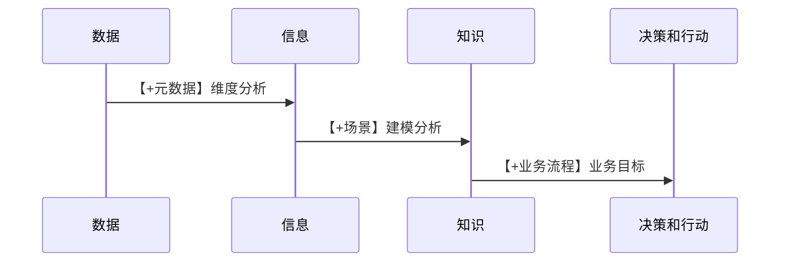

CDA > 课程笔记 > Chap1.用户标签体系与用户画像

<!-- more -->

来源: [CDA level 2 级课堂笔记](https://blog.csdn.net/m0_69037520/article/details/129732340)

## 用户标签体系设计原理

### 如何定位用户？

精准营销的案例：微信朋友圈广告推送（宝马车广告推广）

本质：识别目标消费群体

- 消费意愿
- 消费能力

**1.识别目标消费群体–消费意愿的识别**

- 关注汽车，尤其是宝马相关品牌的公众号
- 经常提到汽车，尤其是宝马的用户
- 时常发汽车图片的用户
- 对汽车类信息评论和转发率高的用户
- 对汽车类信息平评论出现关键词的用户
  搜索汽车，尤其是宝马相关品牌的信息

**2.识别目标消费群体–消费能力的识别**

通过大量推广微信支付进行识别（联合其他软件消费支付进行识别，例如京东、滴滴等）。

通过差异化消费变现也可以识别消费能力。

**3.精准投放**

### 业务指标与用户标签的关系

业务宏观分析–指标

业务微观分析–标签

**1.制定业务指标**（_OSM 模型_）

业务目标–业务策略–度量（KPI） _KPI、平衡记分卡_

**2.北极星指标（阶段核心指标）**

依据各企业经营策略不同而制定。

根据北极星指标进行目标拆解。

_分解方式（关键要素的确定是通过用户所处的状态和业务想要达到的目标拆解而来）_

- 全链漏斗式（例如营收转化漏斗）
- 因子分解型（例如营收构成拆解）

**3.业务指标的分层方式**

北极星指标（战略） 营收

一级指标（管理） （新+老客户）\* 客单价

二级指标（运营） 线上渠道+线下渠道

三级指标（操作） 活动 1+活动 2

**4.企业决策层次和对数据的需求**

| 企业业务层级 | 决策需求           | 数据产品类型    | 数据范围          | 数据获取方式                     |
| ------------ | ------------------ | --------------- | ----------------- | -------------------------------- |
| 战略         | 做什么？为什么做？ | 市场/行业指标型 | 市场/行业外部数据 | 国家统计局、行业报告、市场调研等 |
| 管理、运营   | 做的如何？         | 智能报表型      | 企业内部数据      | 企业业务系统                     |
| 操作         | 如何做？           | 智能分析决策型  | 内部+外部数据     | 企业业务系统+外部数据供应商      |

**5.标签是操作层面支持数据科学的基础**

标签：对分析对象的洞察

**6.企业数据应用能力等级**

统计分析阶段 → 决策支持阶段 → 数据驱动阶段 → 运营优化阶段

宏观：指标 微观：标签 宏微观结合

### 用户标签与用户画像的关系

**1.市场细分**

用户细分是进行市场细分的工具。市场细分是产品研发的前置条件，产品销售阶段根据产品研发的用户画像进行渠道匹配。

用 STP 进行市场定位：选择目标市场

STP 模型：

- S（细分市场）

  - 根据消费者差异确定细分要素和市场
  - 利用五个关键指标量细分市场（可测量、可盈利、可进入、可区分、相对稳定）

- T（选择目标市场）

  - 评估每个细分市场的吸引力
  - 根据自身与市场匹配度选择细分市场
  - 确定市场营销策略

- P（市场定位）

  - 决定在目标消费群体中占据什么位置

**2.用户画像的发展历程**

**3.客户的决策进程**

|       确认需要       |            → 信息收集            |                  → 方案评估                  |      → 购买决策      |     → 购后行为     |
| :------------------: | :------------------------------: | :------------------------------------------: | :------------------: | :----------------: |
|    ↑  特质需要    |        ↓  行为意向数据        |               ↓  访谈/问卷                |  ↓  行为模式数据  | ↑  行为结果数据 |
| 个人特质 需求阶段 | 个人来源 商业来源 公共来源 | 产品属性 品牌信念 效用函数 评估模型 | 他人态度 意外情况 |      事后评价      |

**三类精准营销方法：**

- 识别出产品或服务的刚需群体
- 直接获取客户的需求信息
- 根据场景交叉销售

**4.为什么要做用户画像？**

_通过对产品已有客户进行画像，定位目标群体。_

**5.用户画像反应用户对某些产品的收益或者成本**

**6.马斯洛需求理论**

- 生理需求
- 安全需求
- 归属需求
- 尊重需求
- 自我实现

精准营销实际定位刚需人群。

**7.经济学原理：消费者决策与马斯洛需求层次理论**

**8.用户标签与产品属性**

### 用户标签的类型

**1.四种客户细分方法**

_目前国内银行主要采用将双重细分作为短期的速赢方案。_

- **层级细分（操作效率；例如：资产阈值划分）**

  - 根据客户当前资产规模将其分为 4\~6 层（二八原则划分）
  - 相应设计不同的服务模式

  优点：

  - 数据需求低，只需要使用客户的金融资产
  - 方便理解，容易和客户沟通

  缺点：

  - 难以基于此而设计符合客户需求的特定产品和服务

- **客群细分（客户需求；根据客户标签进行客群细分）**

  - 采用多个维度（包括资产、人口特征、客户行为等主要变量），探索客户的需求形成特定产品需求的客群
  - 然后有针对性的设计产品和服务

  优点：

  - 客群有共同的需求，共同的特征
  - 可以按照客群生命周期进行管理

  缺点：

  - 容易造成误会，以为是以产品为中心
  - 因为产品数量有限，不能实现高粒度化得举措设计

- **双重细分**

  - 首先，按照资产规模和贡献潜力等战略维度对客户进行细分。这决定了资源分配、接触频率和渠道等。
  - 其次，在每层战略细分客群内，采用产品客群或者一系列变量形成策略性子客群以推动营销、产品推荐等。

  优点：

  - 有助于围绕客户价值进行组织
  - 同时可以在客户价值基础上，结合客户在某一产品客群上的行为进行更好的细分

  缺点：

  - 相比 1 和 2，更多数据导致客户归属模糊不清

- **先进细分（通过算法，更多的维度进行细分）**

  - 收集所有结构化和非结构化数据维度（可多达上千种标签）以支持特定产品、服务和营销活动建议。
  - 可以支持与客户 1 对 1 定制化方案。

优缺点与客群细分一致。

## 用户标签的制作方法

### 标签体系整体框架

**1.个人标签体系示例**

- 身份属性
- 教育属性
- …

**2.用户标签的时态分类**

- 静态数据
  属性数据
- 动态数据（时点）

例如：账户余额，流量信息累积的结果。

- 动态数据（期间）
  例如：本月收入，流量数据、行为数据

**3.用户标签的技术层面分类**

### 基础标签

从基础数据中的用户主数据直接提取的标签。基本的 SQL 直接获取。

### 统计标签

从基础数据中的交易数据通过汇总计算的标签。用 SQL 的汇总函数实现。

例如：用户资产汇总、用户行为偏好

经典模型：RFM（变量计算框架）

### 模型标签

根据一定的业务需求建立算法模型。以上面的标签为基础加工。

- **用户潜在需求** 根据用户过往表现，从具体产品出发，挖掘潜在客户，进行精准营销。
- **客户消费偏好** 根据客户的消费行为，获取购物、理财等偏好信息。
- **用户风险评分** 展示该行各类信用评分模型结果。
- **业务营销推展** 为支持业务部门某次营销活动而专门开发出来的具有生命周期的用户标签。

**1.规则类模型标签**

基于 RFM 模型计算出来的统计标签的客户级别属于模型标签。

**2.算法类模型标签（用卡人实际性别判别）**

**3.综合应用类模型标签（用户收入等级标签的制作）**

## 用户画像

### 用 python 做用户画像的基础知识

python 绘图功能

描述统计的总结

### 用户画像在诊断阶段中的应用

用户画像的标签

- 静态数据

  - 性别
  - …

- 动态数据（时点）

  - 截止到月底余额
  - …

- 动态数据（期间）

  - 半年出账比
  - …

准备数据集

### 用户画像在指导阶段中的应用

**通过先进用户画像，制定营销策略**

**基于用户画像，构建精准营销模型**
