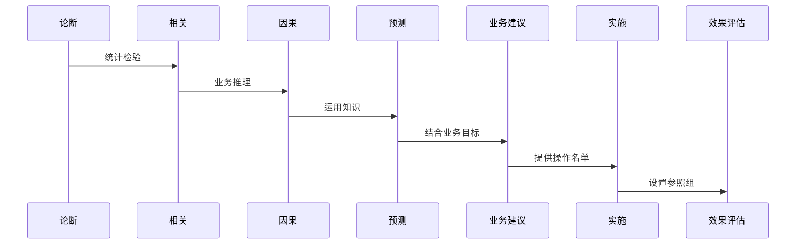

CDA > 课程笔记 > Chap4.统计分析

<!-- more -->

来源: [CDA level 2 级课堂笔记](https://blog.csdn.net/m0_69037520/article/details/129732340)

## 统计分析基础

### 分析框架

**1.关联性分析框架**

关联：

- 偶然关联
- 有统计学意义关联

  - 虚假关联（选择、测量或混杂偏倚）
  - 因果关联（有时间先后）

    - 间接因果关联
    - 直接因果关联

**2.统计分析流程**

提出问题/明确目标 → 设置指标/收集数据 → 选择统计方法/构造理论模型 → 检验是否通过（否的化就继续循环过程）→ 应用模型（分类研究、结构分析、相关分析、预测决策）

**3.统计分析主要内容**

统计方法：

- 描述分析
- 统计推断
  - 参数估计
  - 假设检验

**4.两大类统计分析方法**

描述性分析：

- 总体规模
- 对比关系
- 集中趋势
- 离散程度
- 偏态峰态
- …

推断性分析：

- 参数估计
- 假设检验
- 列联分析
- 方差分析
- 相关分析
- …

### 样本与总体

总体：研究所感兴趣的所有个体组成总体

样本：从总体中抽取的部分个体组成样本，样本用于对总体的某些指标作为推断使用

参数和统计量：统计量由样本获取，用于对总体的参数进行估计

- 参数：总体的特征
- 统计量：样本可测的特征
- 抽样分布：从总体随机抽取的样本中给出统计量的概率分布
- 统计推断：根据从总体随机抽取的样本中给定的统计量估计总体参数

正态分布、三大分布（泊松分布、伽马分布、对数正态分布）都属于整体分布

t 分布、F 分布、卡方分布属于抽样分布

- 正态分布（例如：身高，线性回归预测）
- 泊松分布（总体无限大，概率比较小；例如排队时的队伍长短；泊松回归预测）
- 伽马分布（例如：保险行业损失额度；伽马回归预测）
- 对数正态分布（取对数后服从正太分布；例如收入服从对数正态分布，收益率服从正态分布，收入是收益率的积分；对收入取对数后线性回归）

**中心极限定理：只要样本量足够大（大于 30），无论总体呈现什么分布，抽样的样本均值总是服从正态分布**

### 参数估计

参数是刻画总体某方面的分布特性的数量。

- 均值的标准误差是衡量估计的均值的变异程度
- 均值的标准误差随样本的标准差变化而变化

<!-- prettier-ignore-start -->
- 均值的标准误差（标准误）：
    
    S_{\bar x}=\frac{S}{\sqrt{n}}
    
- 置信区间：
    
    \bar{x}\pm t\cdot S_{\bar x}
    
  -  \bar{x}  样本均值
  -  t  置信度，自由度为样本量-1

<!-- prettier-ignore-end -->

**1.参数估计的步骤**

- 选定参数：确定需要估计的参数
  - 总体均值的估计：单总体均值，两总体均值之差
  - 总体比例的估计：
  - 总体方差（标准差）的估计：
- 选定统计量：确定估计参数的统计量
- 抽样分布：已知或假定模型分布
  - 总体均值服从正态分布，则抽样分布服从：
    
    \bar x \sim N(\mu,\frac{\sigma^2}{n})
    
- 估计：得出结果

**2.矩估计**

优点：

- 不依赖总体的分布，简便易行
- 只要 n 充分大，精确度也很高

缺点：

- 精度较差
- 要求总体的某个 k 阶矩存在（柯西分布不存在，因此不适用）
- 要求未知参数能写成总体的原点矩的函数形式

**3.极大似然估计**

前提：必须知道概率密度。

令一阶偏导数为 0，取到极大似然值。

- 优点：利用了分布函数形式，得到的估计值的精度一般较高
- 缺点：要求必须知道总体的分布函数形式

## 假设检验

### 假设检验的示例

- 建立假设
- 设置显著度水平
- 收集数据
- 决策依据

### 假设检验的基本概念

- 事先对总体分布或总体参数作出某种假设，然后利用样本信息来判断原假设是否成立
- 可分为参数假设检验和非参数假设检验
- 逻辑上类似于“反证法”，统计学上称为“小概率原理”

**1.小概率原理**

指概率很小的事件在一次试验中几乎不可能出现。

**2.基本概念**

- 原假设：
  - 待检验的假设，用 H0 表示
  - 假设总体参数无显著变化
- 备择假设：
  - 与原假设相反

**3.假设表达式**

双侧/单侧

### 假设检验中的两类错误

- 弃真（α）：越小的话 β 越大，因此不追求过分小
- 存伪（β）：分布变瘦可降低错误（提高样本量）

### 假设检验与区间估计的联系

- 相同点：通过样本得到的统计量对总体参数进行推断。
- 区间估计：总体参数 μ 未知，通过样本估计 μ 的置信区间
- 假设检验：先对总体参数 μ 提出假设，再通过样本检验假设是否成立

### 假设检验的基本步骤

<!-- prettier-ignore-start -->
- 提出原假设，确定业务需求
- 选择合适的检验统计量
  - 已知总体方差，Z 检验：
    
    Z = \frac{\bar{x}-\mu_{0}}{\sigma/\sqrt{n}}
    
  - 总体方差未知，t 检验：
    
    t = \frac{\bar{x}-\mu_0}{S_{\bar{x}}}
    

<!-- prettier-ignore-end -->

- 确定显著性水平 α
  - 常用取值 0.01，0.05
- 计算检验统计量
  - 把待检验的值代入统计量中进行计算
- 作出统计决策，接受或拒绝原假设
  - α 临界值法 -- 最常用
  - P 值法 -- 最好用
  - 置信区间法 -- 原理最简单

> 样本量 2000 对应千分之一的三星显著；
> 样本量 1000 对应百分之一的二星显著；
> 样本量 500 对应百分之五的中等显著（一星）；
> 样本量 100 对应百分之十的显著。样本量降低的话可以适当调整 p 值的数值。

### 配对样本 T 检验

用于检验两配对样本的均值是否有显著性差异（总体应服从或近似服从正态分布），可分为两种：

- 用于同一研究对象分别给予两种不同处理结果
- 对同一研究对象处理结果前后进行比较

**检验步骤：**

<!-- prettier-ignore-start -->
- 提出假设：
  - 原假设：
    
    H_{0} : \mu = \mu_{1} = \mu_{2}
    
  - 备择假设：
    
    H_{1} : \mu_{1} \ne \mu_{2}
    
- 建立检验统计量：设两总体 X，Y 分别服从正态分布，两样本之差
    
    d \sim N(\mu, \sigma^2)
    
  则：
    
    t = \frac{\bar{d}}{s/\sqrt{n}}
    

<!-- prettier-ignore-end -->

### A/B 测试优化法

典型过程：

- 确定目标
- 开始做实验
- 借助工具，收集实验数据
- 让数据说话，校验实验结果
- 继续重复步骤，下一次迭代

提交转化率 ✖ 有效转化率 ✖ 购买转化率 = 整体有效率

优化指标：以提高整体有效率为目标，但是也要兼顾每个步骤的指标，重点关注各版本最终带来的有效线索转化情况。

## 两变量关联性检验

| 预测变量的类型 X / 反应变量类型 Y | 分类（包含名义和等级）                                | 连续                                                  |
| --------------------------------- | ----------------------------------------------------- | ----------------------------------------------------- |
| 分类（包含名义和等级）            | 交叉表（列联表）分析 卡方检验                     | 双样本 T 检验（二分类） 方差分析（多分类，ANOVA） |
| 连续                              | 双样本 T 检验（二分类） 方差分析（多分类，ANOVA） | 相关分析                                              |

注解：交叉表是描述性分析，卡方检验是检验两者差异是否显著。

### 两样本 t 检验

例：信用卡月均消费金额是否可以预测办理分期的可能性？

**用于检验两独立样本是否来自相同均值的总体（总体应服从或近似服从近似正态分布）**

**1.检验步骤**

- 提出假设：原假设 H0：u1-u2=0，备择假设 H1：u1-u2≠0
- 建立检验统计量：设两样本分别服从 N1\~(μ1，σ1²)和 N2\~(μ2，σ2²)的总体，则：

<!-- prettier-ignore-start -->

  - 当两总体未知且相等：
  
  t=\frac{\bar x_1 - \bar x_2}{S_p \sqrt {\frac{1}{n_1}+\frac{1}{n_2}} }
  
  - 当两总体未知且不相等：
  
  t=\frac{\bar x_1 - \bar x_2}{\sqrt{\frac{s^2_1}{n_1}+\frac{s^2_2}{n_2}}}
  

<!-- prettier-ignore-end -->

- 计算检验统计量的观测值和 p 值

  - 将样本数据代入，计算出 t 统计量的观测值和对应的概率 p 值

- 作出统计决策

  - 若 p ＜ α，落入拒绝域，则拒绝原假设，认为两总体均值有显著差异

**2.两样本 T 检验和配对样本 T 检验的区别**

- 两独立样本 t 检验用于检验两个独立样本是否来自具有相同均值的总体，相当于两个正态分布总体的均值是否相等。
- 配对样本 t 检验用于检验一个样本的两种处理方法或两个相关的样本均值是否相等，实质是检验差值 d 的均值和零均值之间的显著性。

**3.双样本的 T 检验流程**

双样本 T 检验：

- Levene 方差齐性检验（显著） → 拒绝原假设，认为方差不相等
- Levene 方差齐性检验（不显著） → 则不能拒绝原假设，认为方差相等

**4.双样本 T 检验的前提条件**

- 观测之间独立
- 每一组均服从正态分布
- 每一组的方差相同

**5.检验方差齐性的 F 检验**


F (组间变异, 组内变异) = MS_M / MS_E


### 方差分析

多分类变量与连续变量检验。二分类使用方差分析势比较低，使用双样本 T 检验更好。

例：不同教育水平的人会有明显差异的信用卡消费金额吗？

**方差分析：检验多组样本均值间是否有差异。**

**1.ANOVA 分析的组间变异、组内变异和总变异**


SS_T = SS_M + SS_E


不能被模型解释的是组内差异（SSE），也就是残差。

**2.决定系数（R²）**

代表了总方差被预测变量所解释或决定的比率


R^2 = \frac{SS_M}{SS_T}


值域为[0,1]，系数越大解释力度越好。

**3.单因素方差分析模型**

因变量 = 原假设成立设计的均值 + 均值的变更效应+残差

**4.评估单因素方差分析**

- 注意数据中不同组的数据要服从独立性假设
- 数据服从正太分布
- 方差齐性要求

### 相关分析

两个连续变量之间的关系。

例：收入对客户信用卡支出是否有预测价值。

- pearson 相关系数（线性相关）
- spearman 秩相关系数（有序变量）

### 卡方检验

两个分类变量（包含名义和等级变量）的关系。

例：不同教育水平的人开信用卡的可能性有差异吗？

列联交叉表：统计出现的频次统计比率。

使用卡方检验进行进一步操作。

- 卡方检验和对应的 P 值

  - 确定相关性是否存在
  - 不能测量相关性的强弱
  - 取决于样本量，并反映样本量

<!-- prettier-ignore-start -->


\chi^2 = \sum^R_{i=1}\sum^C_{j=1}\frac{(Obs_{ij}-Exp_{ij})^2}{Exp_{ij}}


<!-- prettier-ignore-end -->

## 单变量影响度分析

### 一元线性回归模型

| 反应变量的类型 Y/预测变量的类型 X | 分类                             | 连续                      | 连续和分类           |
| --------------------------------- | -------------------------------- | ------------------------- | -------------------- |
| 连续                              | 方差分析（ANOVA）                | 普通最小二乘法（OLS）回归 | 协方差分析（ANCOVA） |
| 分类                              | 列联表分析或逻辑（Logistic）回归 | 逻辑回归                  | 逻辑回归             |

- 比较均值：单因素（做方差分析，检验一个分类变量和一个连续变量是否独立）
- 一般线性模型：单因素（做方差分析，检验多个分类变量和一个连续变量是否独立）
- 回归：线性（做 OLS，建立多个连续变量和一个连续变量的模型）
- 广义线性模型：广义线性模型（做协方差分析，建立多个分类变量与连续变量和一个连续变量的类型）

例：目前一些客户注册后没有开卡，根据现有属性预测开卡后的消费情况。


Y = \beta_0 + \beta_1X_1 + \xi


模型检验：拟合优度

回归方程的整体性检验：

### 线性回归的参数估计

- 矩估计
- 最小二乘估计（Y 服从正太分布的极大似然特例）
- 极大似然估计

找到一条直线，使残差平方和最小。残差实际存在，扰动项理论存在。

线性回归的方法推导：极大似然估计

线性回归的正则方法：

- 岭回归：惩罚项的形式为斜率系数的平方
- Laso（拉松算法）：惩罚项的形式为斜率系数的绝对值

### 一元逻辑回归模型

例：客户流失的预测

预测变量：在网时长；反应变量：用户流失

**1.优势比（odds）**


Odds = \frac{Pevent}{1-Pevent}


反映了一个特定事件在一个组发生的可能性相对于另一个组发生的可能性的大小。

odds ratio：发生比的比


P = \frac{1}{1+e^{-(\beta_0+\beta_1x)}}


### 极大似然估计法（逻辑回归）

效用函数：

<!-- prettier-ignore-start -->


y^* = x^，\beta + \xi

 

y=\left\{\begin{matrix} 
  1, if:y^* \gt  0; \\  
  0, if:y^* \le  0.
\end{matrix}\right. 


<!-- prettier-ignore-end -->

一般无法求导时，使用 Newton-Raphsopn 进行数值计算。

正则化的逻辑回归：

- 岭回归（L2 正则）
- Lasso 回归（L1 正则）

根据最小二乘法拟合直线回归方程是使残差平方和取得最小。

线性回归模型中误差项的均值（期望）为 0。
