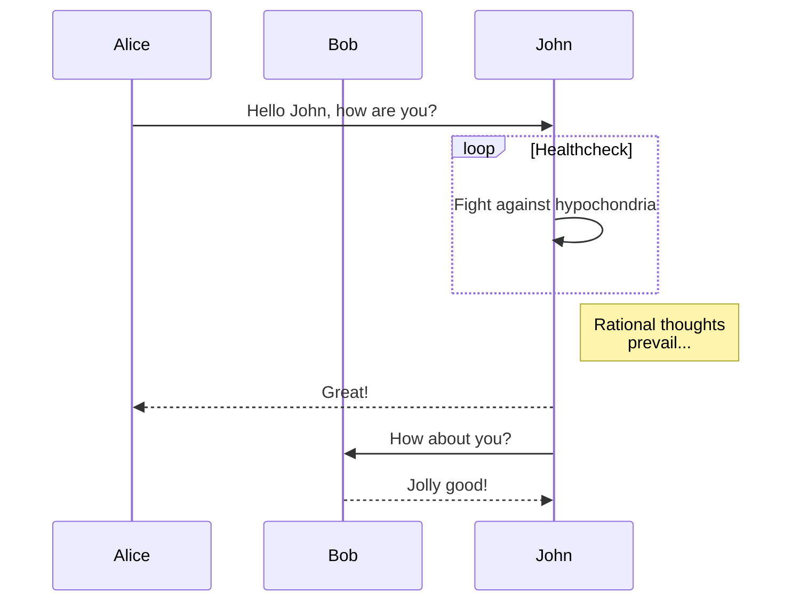
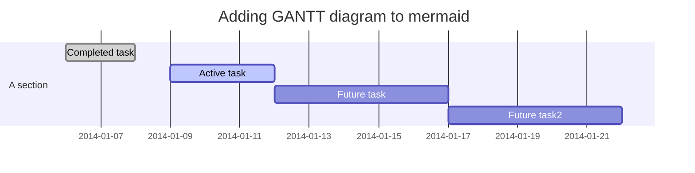
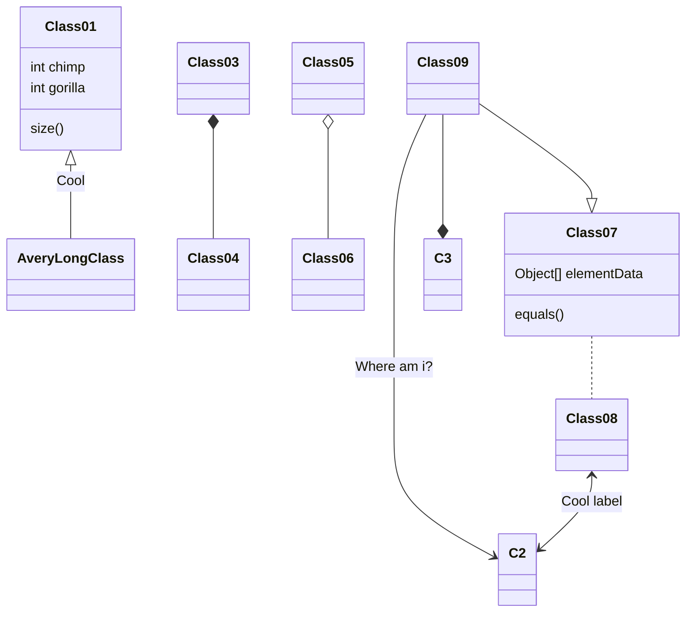

记录 mermaid 图表的使用方法

<!-- more -->

## 背景

发现 mermaid 这一渲染图表的神器,只可惜 Hexo 原生不支持,
调查一圈发现有插件[hexo-filter-mermaid-diagrams](https://github.com/webappdevelp/hexo-filter-mermaid-diagrams)支持。
不过要使用的话,需要修改主题那块代码,
本着能的原则,
发了一条[GitHub Issue](https://github.com/Candinya/Kratos-Rebirth/issues/47),请求主题的作者,作者立马就改好了。感谢作者大大( •̀ ω •́ )✧

## 共通

1. 安装 hexo-filter-mermaid-diagrams

```shell
# 二选一
npm i hexo-filter-mermaid-diagrams --save
yarn add hexo-filter-mermaid-diagrams
```

1. 编写内容
   - 如同一般一般代码块,先写三个反引号
   - 后面接上`mermaid `
   - 最后再加 3 个反引号
1. 例如
   

## 流程图 flowchart

### 代码

```
graph TD;
    A-->B;
    A-->C;
    B-->D;
    C-->D;
```

### 图形


## 时序图 Sequence diagram

### 代码

```
sequenceDiagram
    participant Alice
    participant Bob
    Alice->>John: Hello John, how are you?
    loop Healthcheck
        John->>John: Fight against hypochondria
    end
    Note right of John: Rational thoughts <br/>prevail...
    John-->>Alice: Great!
    John->>Bob: How about you?
    Bob-->>John: Jolly good!
```

### 图形



## 甘特图 Gantt diagram

### 代码

```
gantt
dateFormat  YYYY-MM-DD
title Adding GANTT diagram to mermaid

section A section
Completed task            :done,    des1, 2014-01-06,2014-01-08
Active task               :active,  des2, 2014-01-09, 3d
Future task               :         des3, after des2, 5d
Future task2              :         des4, after des3, 5d
```

### 图形



## Class diagram (experimental)

### 代码

```
classDiagram
Class01 <|-- AveryLongClass : Cool
Class03 *-- Class04
Class05 o-- Class06
Class07 .. Class08
Class09 --> C2 : Where am i?
Class09 --* C3
Class09 --|> Class07
Class07 : equals()
Class07 : Object[] elementData
Class01 : size()
Class01 : int chimp
Class01 : int gorilla
Class08 <--> C2: Cool label
```

### 图形


