fio（Flexible I/O Tester）是 Linux 生态中最强大的磁盘 I/O 基准测试工具，由 Jens Axboe（Linux 内核 block 层维护者）开发。它不仅能模拟顺序读写、随机读写等典型负载，还支持数十种 I/O 引擎，可精确复现数据库、Web 服务器、消息队列等真实场景的磁盘行为。

本文是一份面向首次使用者的 fio 全面指南，从安装到实战报告解读，逐步深入。

<!-- more -->

## 安装

fio 在各大平台都有对应的安装方式。

### Linux

各主流发行版的官方仓库均已收录 fio：

```bash
# Debian / Ubuntu
sudo apt install fio

# RHEL / CentOS / Fedora
sudo yum install fio       # RHEL 7
sudo dnf install fio       # RHEL 8+ / Fedora

# Arch Linux
sudo pacman -S fio
```

验证安装：

```bash
fio --version
# fio-3.36
```

### macOS

```bash
brew install fio
```

### Windows

Windows 版 fio 以预编译二进制形式发布。从 [fio Releases](https://github.com/axboe/fio/releases) 页面下载 `fio-x.xx-x64.msi` 安装包，双击安装后会自动加入 `PATH`。

```powershell
fio --version
```

## 基本概念

在开始写 fio 命令之前，先理解几个磁盘 I/O 领域的核心概念——它们直接对应 fio 的参数。

### 顺序 vs 随机

| 模式 | 含义 | fio 参数 | 典型场景 |
|------|------|----------|---------|
| 顺序读（Sequential Read） | 从磁盘连续位置读取大块数据 | `--rw=read` | 视频播放、文件拷贝、日志归档 |
| 顺序写（Sequential Write） | 向磁盘连续位置写入大块数据 | `--rw=write` | 视频录制、数据备份 |
| 随机读（Random Read） | 从磁盘任意位置读取小块数据 | `--rw=randread` | 数据库查询、缓存读取 |
| 随机写（Random Write） | 向磁盘任意位置写入小块数据 | `--rw=randwrite` | 数据库写入、OLTP 事务 |

### 块大小（Block Size）

一次 I/O 操作读/写的数据量，单位通常为 KB。**顺序 I/O 用大块（如 1M），随机 I/O 用小块（如 4K）**。

| 参数 | 含义 |
|------|------|
| `--bs=4k` | 每次 I/O 操作 4KB（随机读写常用） |
| `--bs=1m` | 每次 I/O 操作 1MB（顺序读写常用） |

### IOPS vs 吞吐量

这两个指标是磁盘性能的两面，关系为：**吞吐量 = IOPS × 块大小**。

| 指标 | 含义 | 在 fio 中的输出字段 |
|------|------|-------------------|
| IOPS | 每秒完成的 I/O 操作次数 | `IOPS=` |
| 吞吐量（Throughput）| 每秒传输的数据量（KB/s、MB/s） | `BW=` |

随机 4K 场景下主要看 **IOPS**（块太小，吞吐量高不了），顺序 1M 场景下主要看**吞吐量**。

### 队列深度

操作系统同一时刻在 I/O 队列中等待处理的请求数。**高队列深度模拟高并发场景**。

在 fio 中由两个参数共同决定：

| 参数 | 含义 |
|------|------|
| `--iodepth=32` | 每个作业的 I/O 队列深度，即同时可以有 32 个 I/O 请求在等待 |
| `--numjobs=4` | 启动 4 个并发的 fio 作业进程/线程 |

实际总 I/O 并发 = `numjobs × iodepth`。例如 `--numjobs=4 --iodepth=32` 表示同时最多有 128 个 I/O 请求在排队。

### Direct I/O

默认情况下，Linux 的 I/O 会经过页面缓存（Page Cache），这导致测试可能是在测**内存速度**而非磁盘速度。`--direct=1` 绕过缓存，直接读写磁盘。

| 参数 | 含义 |
|------|------|
| `--direct=1` | 使用 Direct I/O（O_DIRECT），绕过 OS 缓存 |
| `--direct=0` | 默认值，使用缓冲 I/O，可能命中缓存 |


- Direct I/O 要求**块大小对齐**存储设备扇区（通常 512 字节或 4K），否则 fio 会报错
- 大多数真实性能测试都应开启 `--direct=1`，否则结果偏差极大


### I/O 引擎

fio 支持多种与操作系统交互的 I/O 引擎，决定了**如何**将 I/O 请求下发到内核：

| 引擎 | 特点 | 适用场景 |
|------|------|---------|
| `sync`（默认） | 同步读写，一次一个请求，最简单 | 基础测试 |
| `psync` | 同步读写 + `pread/pwrite` 系统调用 | 与 sync 类似，但使用 lseek 替代 |
| `libaio` | Linux 原生异步 I/O，支持高 iodepth | **最常用**，高并发随机读写 |
| `io_uring` | Linux 5.1+ 新异步框架，比 libaio 更高效 | 追求极致性能 |
| `mmap` | 内存映射文件 I/O | 特定场景 |
| `falloc` | 仅分配文件空间，不做实际 I/O | 测试文件系统分配速度 |



- **一般测试首选 `libaio`**：支持高 iodepth，结果最贴近真实应用
- **Windows 用户**：用 `--ioengine=windowsaio`
- **macOS 用户**：用 `--ioengine=posixaio`



## 核心参数体系

fio 的参数分为几个大类，理解分类有助于快速找到需要的参数：

```mermaid
graph TD
    FIO[fio 命令] --> JOB[作业参数<br/>Job Parameters]
    FIO --> IO[I/O 参数<br/>I/O Parameters]
    FIO --> ENGINE[引擎参数<br/>Engine Parameters]
    FIO --> OUTPUT[输出参数<br/>Output Parameters]

    JOB --> J1["--name 作业名"]
    JOB --> J2["--filename 目标文件/设备"]
    JOB --> J3["--size 测试数据量"]
    JOB --> J4["--runtime 运行时长"]
    JOB --> J5["--numjobs 并发作业数"]
    JOB --> J6["--group_reporting 合并报告"]

    IO --> I1["--rw 读写模式"]
    IO --> I2["--bs 块大小"]
    IO --> I3["--iodepth 队列深度"]
    IO --> I4["--direct=1 绕过缓存"]

    ENGINE --> E1["--ioengine 引擎类型"]
    ENGINE --> E2["--sync=1 同步模式"]
    ENGINE --> E3["--fsync=1 每次写后强制刷盘"]

    OUTPUT --> O1["--output 写到文件"]
    OUTPUT --> O2["--output-format=json"]
    OUTPUT --> O3["--minimal 精简输出"]
    OUTPUT --> O4["--eta 显示进度"]
```



### fio 命令的通用语法

```bash
fio [全局选项] [作业选项] --name=job1 [作业1选项] --name=job2 [作业2选项] ...
```

- `--name` 之前（或作业文件 `[global]` 节）的参数是**全局参数**，对所有作业生效
- `--name=xxx` 之后的参数仅对该作业生效
- 大多数参数既可以在命令行指定，也可以写在作业文件（Job File）中

## 第一个测试命令

从一个最简单的顺序读测试开始，逐参数理解每个选项的意义。

```bash
fio --name=seq-read --rw=read --bs=1m --size=1G --filename=/tmp/fio_test --direct=1 --numjobs=1 --iodepth=1
```



| 参数 | 值 | 含义 |
|------|----|------|
| `--name` | `seq-read` | 作业名称，会在报告中显示为标识 |
| `--rw` | `read` | 顺序读模式 |
| `--bs` | `1m` | 块大小 1MB，顺序读写通常用大块 |
| `--size` | `1G` | 总共读 1GB 数据 |
| `--filename` | `/tmp/fio_test` | 读写的目标文件（也可以是块设备路径如 `/dev/sdb`） |
| `--direct` | `1` | 绕过 OS 页面缓存 |
| `--numjobs` | `1` | 只启动 1 个并发作业 |
| `--iodepth` | `1` | 队列深度为 1，即串行 I/O |



> **关于 `--filename`：** 可以指定文件路径（fio 会自动创建），也可以指定裸块设备（如 `/dev/sda`）。操作块设备会**破坏其上所有数据**，务必小心。

### 运行示例输出

执行后，fio 会打印详细的测试统计。核心部分如下（数值为示例）：

```
seq-read: (g=0): rw=read, bs=(R) 1024KiB-1024KiB, (W) 1024KiB-1024KiB, (T) 1024KiB-1024KiB, ioengine=psync, iodepth=1
fio-3.36
Starting 1 process
...
seq-read: (groupid=0, jobs=1): err= 0: pid=12345: ...
  read: IOPS=210, BW=210MiB/s (220MB/s)(1024MiB/4876msec)
    ...
  cpu          : usr=0.50%, sys=2.31%, ctx=...
  ...
```

关键字段：`BW=210MiB/s` 表示吞吐量为 210 MiB/s，`IOPS=210` 表示每秒 210 个 I/O 操作（1M 块大小下，IOPS 与 MB/s 数值接近是正常的）。

## 常用测试模式

下面列出一组覆盖主流场景的 fio 命令，可直接复制使用（请将 `/tmp/fio_test` 替换为实际目标路径）。

### 顺序读写

顺序读写模拟大文件的连续传输，关注**吞吐量**指标。

**顺序读：**

```bash
fio --name=seq-read --rw=read --bs=1m --size=1G --filename=/tmp/fio_test --direct=1 --numjobs=1 --iodepth=1
```

**顺序写：**

```bash
fio --name=seq-write --rw=write --bs=1m --size=1G --filename=/tmp/fio_test --direct=1 --numjobs=1 --iodepth=1
```

### 随机读写

随机读写模拟数据库 OLTP、邮件服务器等场景，关注**IOPS**和**延迟**指标。

**随机读（4K 块）：**

```bash
fio --name=rand-read --rw=randread --bs=4k --size=1G --filename=/tmp/fio_test --direct=1 --numjobs=1 --iodepth=32
```

**随机写（4K 块）：**

```bash
fio --name=rand-write --rw=randwrite --bs=4k --size=1G --filename=/tmp/fio_test --direct=1 --numjobs=1 --iodepth=32
```


顺序读写场景下，磁盘可以预读、合并请求，iodepth 为 1 就足以跑满带宽。但随机读写中，每次 I/O 都可能需要磁头寻道（HDD）或 NAND 页读取（SSD），单队列深度无法充分利用磁盘内部的并行能力。SSD 尤其受益于高 iodepth（32~256），IOPS 会随 iodepth 提升而显著增长。


### 混合读写

`--rw=randrw` 表示同时进行随机读和随机写，通过 `--rwmixread` 控制读写比例。

**70% 读 + 30% 写的混合随机负载：**

```bash
fio --name=rand-mix --rw=randrw --rwmixread=70 --bs=4k --size=1G --filename=/tmp/fio_test --direct=1 --numjobs=4 --iodepth=32 --group_reporting
```

| 参数 | 含义 |
|------|------|
| `--rw=randrw` | 随机混合读写 |
| `--rwmixread=70` | 读占比 70%（写自动占 30%） |
| `--group_reporting` | 合并所有作业的报告输出，不按单个作业分开展示 |

### 多作业并发

`--numjobs` 可以模拟多个进程同时读写不同文件或同一文件的不同区域：

```bash
fio --name=multi-job --rw=randread --bs=4k --size=1G --filename=/tmp/fio_test --direct=1 --numjobs=8 --iodepth=16 --group_reporting
```

此命令启动 8 个并发作业，每个 iodepth=16，**总并发 I/O = 8 × 16 = 128**。

### 按时间运行

`--runtime` 替代 `--size` 来指定运行时长，`--time_based` 让 fio 重复执行直到时间到：

```bash
fio --name=timed-test --rw=randread --bs=4k --size=1G --filename=/tmp/fio_test --direct=1 --numjobs=4 --iodepth=32 --runtime=60 --time_based --group_reporting
```

| 参数 | 含义 |
|------|------|
| `--runtime=60` | 运行 60 秒后停止 |
| `--time_based` | 以时间为准（即使 `--size` 指定了数据量，也会跑到 `--runtime` 结束） |

> `--time_based` 不指定时，fio 完成 `--size` 的数据量后立刻退出。加上后，fio 会循环执行直到 `--runtime` 到期——这更适合长时间稳定性测试。

## Job File 作业文件

当参数超过四五行时，命令行变得难以维护。fio 支持将所有参数写入 `.fio` 作业文件，可读性和复用性都更好。

### 基本语法

```ini
[global]
# 全局参数，对所有作业生效
ioengine=libaio
direct=1
size=1G
filename=/tmp/fio_test
group_reporting=1

[seq-read]
rw=read
bs=1m
numjobs=1
iodepth=1

[seq-write]
rw=write
bs=1m
numjobs=1
iodepth=1

[rand-read-4k]
rw=randread
bs=4k
numjobs=4
iodepth=32

[rand-write-4k]
rw=randwrite
bs=4k
numjobs=4
iodepth=32
```

保存为 `benchmark.fio`，执行：

```bash
# 运行所有作业
fio benchmark.fio

# 只运行指定作业
fio --section=rand-read-4k benchmark.fio

# 运行多个指定作业（逗号分隔）
fio --section=seq-read,rand-read-4k benchmark.fio
```

### 完整示例：通用磁盘基准测试

下面是一个可直接使用的完整作业文件，覆盖了磁盘评测的四项核心指标：

```ini
; disk_bench.fio —— 磁盘综合基准测试

[global]
ioengine=libaio
direct=1
size=2G
filename=/tmp/fio_test
group_reporting=1

[seq-read-1m]
rw=read
bs=1m
numjobs=1
iodepth=1

[seq-write-1m]
rw=write
bs=1m
numjobs=1
iodepth=1

[rand-read-4k]
rw=randread
bs=4k
numjobs=4
iodepth=32

[rand-write-4k]
rw=randwrite
bs=4k
numjobs=4
iodepth=32
```



fio 作业文件中，参数值既可以用 `=` 也可以用空格分隔。以下写法等价：

```ini
bs=4k
bs 4k
```

两种风格可以混用。本文统一使用 `=` 风格以保持可读性。`;` 开头的行为注释。



## 输出报告解读

fio 的输出报告非常详尽。以下逐段解释关键字段的含义。

### 基本信息区

```
seq-read: (g=0): rw=read, bs=(R) 1024KiB-1024KiB, (W) 1024KiB-1024KiB, (T) 1024KiB-1024KiB, ioengine=psync, iodepth=1
```

- `g=0`：该作业所属的组编号（对应 `--group_reporting` 的合并粒度）
- `bs=(R)`：实际使用的读块大小范围（最小值-最大值）
- `ioengine=psync`：使用的 I/O 引擎

### 核心指标区

```
read: IOPS=210, BW=210MiB/s (220MB/s)(1024MiB/4876msec)
```

| 字段 | 含义 | 计算方式 |
|------|------|---------|
| `IOPS=210` | 每秒 I/O 操作次数 | `总I/O数 / 总耗时(秒)` |
| `BW=210MiB/s` | 吞吐量（带宽） | `总数据量 / 总耗时(秒)` |
| `(220MB/s)` | 以 MB（10^6）为单位的吞吐量（MiB 以 2^20 为单位） | |
| `(1024MiB/4876msec)` | 总数据量 1024MiB / 总耗时 4876ms | |

### 延迟（Latency）区

这是判断磁盘**响应速度**的核心数据：

```
lat (usec): min=1234, max=56789, avg=2156.78, stdev=423.45
lat (msec): min=1, max=57, avg=2.16, stdev=0.42
clat (usec): min=1150, max=56123, avg=2080.12, stdev=410.23
```

| 字段 | 含义 |
|------|------|
| `lat` | 总延迟 = 提交延迟（slat）+ 完成延迟（clat） |
| `slat`（submission latency） | 从 fio 提交 I/O 请求到内核接手处理的时间 |
| `clat`（completion latency）| 从内核接手 I/O 请求到实际完成的时间（**纯磁盘延迟**） |
| `avg` | 平均延迟 |
| `stdev` | 延迟的标准偏差（越小越稳定） |

**一般关注 `clat`**——它代表磁盘硬件本身处理 I/O 的耗时，去除了操作系统调度的影响。

### 百分位延迟

```
clat percentiles (usec):
 |  1.00th=[ 1400],  5.00th=[ 1556], 10.00th=[ 1608], 20.00th=[ 1720],
 | 30.00th=[ 1768], 40.00th=[ 1824], 50.00th=[ 1864], 60.00th=[ 1936],
 | 70.00th=[ 1992], 80.00th=[ 2096], 90.00th=[ 2280], 95.00th=[ 2544],
 | 99.00th=[ 4128], 99.50th=[ 5088], 99.90th=[ 8768], 99.95th=[11328],
 | 99.99th=[23680]
```

这是衡量磁盘**服务质量**的最重要指标：

| 百分位 | 解读 |
|--------|------|
| 50.00th（中位数） | 50% 的 I/O 请求延迟低于此值 |
| 95.00th | 95% 的请求延迟低于此值（**生产环境常用 SLA 指标**） |
| 99.00th（P99） | 99% 的请求延迟低于此值（**长尾延迟的关键指标**） |
| 99.99th（P9999） | 99.99% 的请求延迟低于此值（**极端情况**） |



即使平均延迟很低，但如果 P99.9 延迟很高，用户体验仍然会很差——比如 1000 个请求中就有 1 个卡顿 2 秒。这就是为什么高并发存储系统（如数据库、消息队列）不仅要看平均延迟，更要关注 P99 和 P999 延迟。



### JSON 输出

fio 支持将结果输出为 JSON 格式，方便自动化分析和绘图：

```bash
fio --name=test --rw=read --bs=1m --size=1G --filename=/tmp/fio_test --direct=1 \
    --output=result.json --output-format=json
```

解析示例（Python）：

```python
import json

with open("result.json") as f:
    data = json.load(f)

for job in data["jobs"]:
    read = job["read"]
    print(f"IOPS: {read['iops']}, BW: {read['bw_bytes'] / 1024 / 1024:.1f} MiB/s")
    print(f"clat avg: {read['clat_ns']['mean'] / 1000:.1f} us")
    print(f"clat P99: {read['clat_ns']['percentile']['99.000000'] / 1000:.1f} us")
```

## 实战场景

### 场景一：SSD 性能评估

评估一块新 SSD 的理论性能天花板，使用大 iodepth 充分挖掘 SSD 的并行潜力：

```bash
# 顺序读/写 —— 测吞吐量上限
fio --name=seq-read --rw=read --bs=1m --size=2G --filename=/dev/nvme0n1 --direct=1 --numjobs=1 --iodepth=32

# 随机读/写 4K —— 测 IOPS 上限
fio --name=rand-read --rw=randread --bs=4k --size=2G --filename=/dev/nvme0n1 --direct=1 --numjobs=4 --iodepth=32 --group_reporting
```

> **严重警告：** 对块设备（`/dev/nvme0n1`）执行 `--rw=write` 会**永久擦除数据**。评估写入性能时务必确认设备上没有需要的数据，或使用 `--filename` 指定一个普通文件。

### 场景二：NAS 网络存储测试

测试 NAS / SMB / NFS 挂载点的读写性能：

```bash
# 假设 NAS 已挂载到 /mnt/nas
fio --name=nas-seq-read --rw=read --bs=1m --size=1G --filename=/mnt/nas/fio_test --direct=1 --numjobs=1 --iodepth=32

fio --name=nas-rand-read --rw=randread --bs=4k --size=1G --filename=/mnt/nas/fio_test --direct=1 --numjobs=8 --iodepth=32 --group_reporting
```

网络存储的性能还受网络延迟影响，可以对比不同 `numjobs` 和 `iodepth` 组合下的变化趋势。

### 场景三：模拟数据库 OLTP 负载

数据库典型的 I/O 模式：随机 8K 读写混合 + 高 iodepth + 数据持久化（fsync）。

**MySQL / PostgreSQL 类 OLTP 写负载模拟：**

```ini
[oltp-write]
rw=randrw
bs=8k
rwmixread=0
size=2G
filename=/tmp/fio_db_test
ioengine=libaio
direct=1
iodepth=32
numjobs=4
fsync=1
group_reporting=1
```

| 参数 | 含义 |
|------|------|
| `bs=8k` | 数据库典型页大小（MySQL InnoDB 默认 16K，这里取 8K 示例） |
| `rwmixread=0` | 纯写负载（修改 `rwmixread` 值可模拟读写混合场景） |
| `fsync=1` | 每完成一次写 I/O 后立即调用 fsync 刷盘——模拟数据库的持久化保证 |

> `fsync=1` 会显著降低性能，但也更贴近真实数据库写入场景。如果去掉 `fsync=1`，测出的写入速度可能偏高 10~100 倍，但对数据库性能评估没有参考价值。

### 场景四：对比启用/禁用缓存

快速验证 Direct I/O 和缓冲 I/O 的差异：

```bash
# 带缓存（默认）
fio --name=cached --rw=randread --bs=4k --size=512M --filename=/tmp/fio_test --numjobs=4 --iodepth=32 --group_reporting

# 直接 I/O（绕过缓存）
fio --name=direct --rw=randread --bs=4k --size=512M --filename=/tmp/fio_test --direct=1 --numjobs=4 --iodepth=32 --group_reporting
```

通常带缓存的 IOPS 会高出几个数量级——这就是为什么性能测试**务必使用 `--direct=1`**。

## 参数速查表

| 目标 | 推荐命令关键参数 |
|------|-----------------|
| SSD 顺序读性能 | `--rw=read --bs=1m --iodepth=32 --numjobs=1` |
| SSD 顺序写性能 | `--rw=write --bs=1m --iodepth=32 --numjobs=1` |
| SSD 随机读 IOPS | `--rw=randread --bs=4k --iodepth=32 --numjobs=4` |
| HDD 顺序读/写 | `--rw=read/write --bs=1m --iodepth=1 --numjobs=1` |
| 数据库 OLTP 写 | `--rw=randrw --rwmixread=0 --bs=8k --fsync=1 --iodepth=32` |
| 混合读写 70R/30W | `--rw=randrw --rwmixread=70 --bs=4k --iodepth=32` |
| 长时间稳定性测试 | `--runtime=300 --time_based` |
| JSON 结果输出 | `--output=result.json --output-format=json` |

## 总结

fio 的学习路径可以概括为：

1. 用最简单的 `--rw=read --bs=1m --size=1G` 跑一次，看懂输出
2. 加入 `--direct=1`，理解缓存对测试结果的影响
3. 引入 `--iodepth` 和 `--numjobs`，理解并发对 IOPS 的提升
4. 使用 Job File 管理复杂测试组合，避免命令行过长
5. 关注 `clat` 和百分位延迟，而非只看平均延迟



- **务必加 `--direct=1`**——缓存会让结果完全没有参考价值
- **先读后写**——评估写入性能前用顺序读探明读取上限，作为参考基线
- **慎用块设备**——对 `/dev/sda` 等裸设备写操作会毁掉数据
- **多次测试取稳定值**——SSD 的 SLC 缓存耗尽后性能可能大幅下降，需要跑够时间观察稳态值
- **监控磁盘使用率**——用 `iostat -x 1` 同步观察 `%util` 和 `await`，判断瓶颈在磁盘还是 fio 参数不够
- **P99 延迟比平均值更重要**——高并发系统最怕长尾延迟



## 参考链接

- [fio GitHub 仓库](https://github.com/axboe/fio)
- [fio 官方文档（How-To）](https://fio.readthedocs.io/en/latest/fio_doc.html)
- [fio man page](https://linux.die.net/man/1/fio)
- [Linux I/O Stack 图解](https://www.thomas-krenn.com/en/wiki/Linux_Storage_Stack_Diagram)
