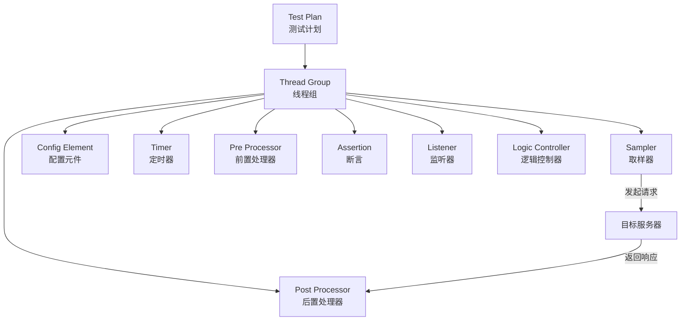
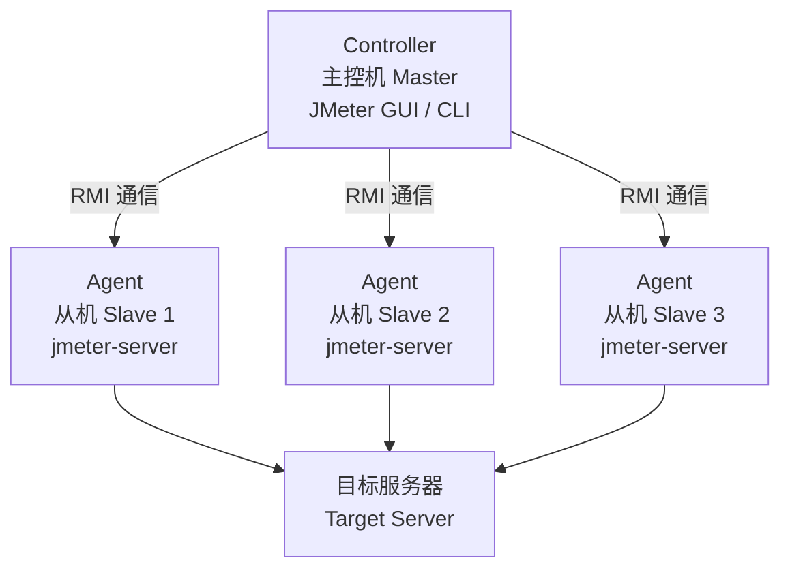

Apache JMeter 是 Apache 基金会开源的纯 Java 压力测试工具，用于对服务器、网络或对象模拟高并发负载，测试不同压力下的整体性能表现。虽然最初为 Web 应用设计，但如今已扩展支持 HTTP、FTP、JDBC、JMS、TCP 等多种协议。

本文是一份面向首次使用者的 JMeter 全面指南，涵盖从安装到分布式测试的核心功能。

<!-- more -->

## 安装与环境配置

### 前置条件

JMeter 依赖 Java 运行环境，需要预先安装 JDK 8 或更高版本：

```powershell
java -version
# java version "1.8.0_401" 或更高版本
```

确认 `JAVA_HOME` 环境变量已正确配置：

```powershell
echo $env:JAVA_HOME
# C:\Program Files\Java\jdk-17
```

### 下载与安装

JMeter 无需安装，从[官网](https://jmeter.apache.org/download_jmeter.cgi)下载 Binary 压缩包（`.zip` 或 `.tgz`），解压到任意目录即可。以 Windows 为例：

```powershell
# 假设解压到 D:\tools\apache-jmeter-5.6.3
Get-ChildItem -LiteralPath D:\tools\apache-jmeter-5.6.3
```

### 目录结构

解压后的关键目录：

| 目录 / 文件 | 说明 |
|-------------|------|
| `bin/` | 启动脚本（`jmeter.bat` / `jmeter.sh`）和配置文件 |
| `bin/jmeter.properties` | JMeter 主配置文件 |
| `bin/log4j2.xml` | 日志配置 |
| `lib/` | 核心依赖 jar 包 |
| `lib/ext/` | 插件目录，第三方插件放这里 |
| `extras/` | 额外工具（如 Ant 构建脚本） |

### 启动 JMeter

**GUI 模式**（适合编写和调试脚本）：

```powershell
# Windows
D:\tools\apache-jmeter-5.6.3\bin\jmeter.bat

# Linux / macOS
./apache-jmeter-5.6.3/bin/jmeter.sh
```

启动后会看到 JMeter 的主界面 —— 左侧是组件树，右侧是配置面板。

> **重要提醒：** GUI 模式仅用于脚本开发和调试。执行真正的压力测试时，务必使用命令行模式，否则 GUI 自身的渲染开销会严重影响测试结果。

## JMeter GUI 界面概览

打开 JMeter 后，界面分为三个主要区域：

**左侧：组件树**

以树形结构组织测试计划的各个组件。根节点永远是「测试计划」，所有组件按层级挂载在其下。右键点击节点可添加子组件。

**右侧：配置面板**

选中树中某个组件后，右侧显示该组件的配置项。不同组件的配置面板内容各不相同。

**顶部工具栏**

提供快捷操作按钮：新建、打开、保存测试计划，启动 / 停止 / 暂停测试运行，清除结果等。

> **操作路径约定：** 本文中所有「右键 → 添加 → ...」的操作均指在左侧组件树上操作。例如「右键点击测试计划 → 添加 → 线程组 → 线程组」表示先选中测试计划节点，右键展开菜单，按路径选择添加。

## 核心组件体系

JMeter 通过不同组件的组合来构建测试场景。理解各组件的职责和**执行顺序**是正确编写脚本的前提。

### 组件分类



| 组件类型 | 职责 | 典型例子 |
|----------|------|---------|
| **Thread Group（线程组）** | 模拟并发用户，控制并发数、循环次数、启动间隔 | 线程组 / setUp 线程组 / tearDown 线程组 |
| **Sampler（取样器）** | 实际发起请求，是唯一能与服务器交互的组件 | HTTP 请求 / JDBC 请求 / FTP 请求 |
| **Config Element（配置元件）** | 为取样器提供默认配置或变量 | HTTP 请求默认值 / CSV Data Set Config / 用户定义变量 |
| **Timer（定时器）** | 控制请求之间的等待间隔 | 固定定时器 / 高斯随机定时器 / Synchronizing Timer |
| **Pre Processor（前置处理器）** | 在取样器执行前对请求做预处理 | 用户参数 / BeanShell 前置处理器 |
| **Post Processor（后置处理器）** | 在取样器执行后处理响应数据 | 正则表达式提取器 / JSON 提取器 |
| **Assertion（断言）** | 对响应结果做校验，判断请求是否成功 | 响应断言 / JSON 断言 / 持续时间断言 |
| **Listener（监听器）** | 收集、展示和保存测试结果 | 查看结果树 / 聚合报告 / 汇总报告 |
| **Logic Controller（逻辑控制器）** | 控制取样器的执行逻辑（条件、循环等） | 循环控制器 / IF 控制器 / 事务控制器 |

### 组件执行顺序

在一次迭代中，各类型组件的执行顺序是**固定的**，与它们在树中的排列位置无关：

```
1. 配置元件（Config Element）
2. 前置处理器（Pre Processor）
3. 定时器（Timer）
4. 取样器（Sampler）
5. 后置处理器（Post Processor）
6. 断言（Assertion）
7. 监听器（Listener）
```

理解这个顺序很重要 —— 比如你想从响应中提取一个 token 传给下一个请求，那么就应该在**后置处理器**中配置提取规则；如果提取失败需要标记请求失败，则在**断言**中校验。

### 作用域规则

组件的作用域由其**在树中的层级位置**决定：

- 挂载在线程组下的组件，作用于该线程组内**所有**取样器
- 挂载在某个取样器下的组件，**仅**作用于该取样器
- 挂载在某个逻辑控制器下的组件，作用于该控制器内**所有**取样器

> **实践技巧：** 将通用的配置（如 HTTP 请求默认值、Cookie 管理器）放在线程组级别，将特定的断言和提取器放在对应的取样器级别。

## 第一个测试计划：HTTP 接口压测

下面从一个最简单的 HTTP 接口测试开始，带你跑通 JMeter 的完整工作流。

### 场景设定

假设有一个 RESTful 接口 `GET https://jsonplaceholder.typicode.com/posts/1`，我们需要模拟 10 个用户并发访问该接口。

### 步骤一：创建线程组

> **操作：** 右键点击「测试计划」→ 添加 → 线程组 → 线程组

在线程组配置面板中设置：

| 参数 | 值 | 说明 |
|------|----|------|
| 线程数 | 10 | 模拟 10 个虚拟用户 |
| Ramp-Up 时间（秒） | 5 | 在 5 秒内逐步启动所有线程，即每 0.5 秒启动一个 |
| 循环次数 | 1 | 每个线程只执行一次（填「永远」则持续运行，需手动停止） |



- **线程数**：同时存在的虚拟用户数量上限。
- **Ramp-Up 时间**：启动所有线程所需的总时长。比如 10 线程 / 5 秒 = 每秒启动 2 个线程。设置合理的 Ramp-Up 可以避免瞬间冲击。
- **循环次数**：每个线程执行取样器的次数。总请求数 = 线程数 × 循环次数。



### 步骤二：添加 HTTP 请求取样器

> **操作：** 右键点击「线程组」→ 添加 → 取样器 → HTTP 请求

配置面板关键字段：

| 参数 | 值 | 说明 |
|------|----|------|
| 协议 | https | 部分 JMeter 版本在输入框中填写 |
| 服务器名称或 IP | jsonplaceholder.typicode.com | 不要带 `https://` 前缀 |
| 端口号 | 443 | HTTPS 默认端口 |
| HTTP 请求方法 | GET | |
| 路径 | /posts/1 | 请求路径，以 `/` 开头 |

> **注意：** 如果你在「HTTP 请求」的「高级」选项卡中看到「协议」字段已独立出来，直接在对应输入框中填写即可。JMeter 不同版本界面略有差异，但字段名称是一致的。

### 步骤三：添加监听器

JMeter 提供了多种监听器来查看测试结果。一次添加三种最常用的：

> **操作：** 右键点击「线程组」→ 添加 → 监听器

分别添加以下三个监听器（重复操作三次）：

**① 查看结果树（View Results Tree）**

展示每个请求的详细信息：请求头、请求体、响应头、响应体。调试阶段最常用的监听器。

**② 汇总报告（Summary Report）**

以表格形式展示关键指标：

| 指标 | 含义 |
|------|------|
| Label | 取样器名称 |
| # 样本 | 请求总数 |
| 平均值 | 平均响应时间（ms） |
| 最小值 / 最大值 | 响应时间的最小 / 最大值（ms） |
| 标准偏差 | 响应时间的离散程度 |
| 异常 % | 失败请求占比 |
| 吞吐量 | 每秒完成的请求数（TPS） |

**③ 聚合报告（Aggregate Report）**

比汇总报告更详细，额外包含中位数（50% 响应时间）、90%/95%/99% 百分位、发送/接收速率等。

### 步骤四：保存并运行

点击顶部工具栏的**保存**按钮（`Ctrl+S`），将测试计划保存为 `.jmx` 文件（这是 JMeter 的项目文件，本质是 XML）。

点击**绿色三角按钮**或按 `Ctrl+R` 启动测试。

运行过程中可以观察：
- 右上角的 **运行状态指示器**（绿色 = 运行中，灰色 = 停止）
- 右上角的 **运行计数**（当前线程数 / 总线程数）
- 各监听器中的**实时数据刷新**

### 步骤五：解读结果

切换到「聚合报告」标签页，典型的结果示例如下：

| Label | # 样本 | 平均值 | 最小值 | 最大值 | 标准偏差 | 异常 % | 吞吐量 |
|-------|--------|--------|--------|--------|----------|--------|--------|
| HTTP 请求 | 10 | 185 | 152 | 298 | 45.3 | 0.00% | 8.2/sec |

解读：
- **平均值 185ms**：平均每个请求耗时 185 毫秒
- **吞吐量 8.2/sec**：每秒处理了 8.2 个请求
- **异常 0.00%**：所有请求均成功返回
- **标准偏差 45.3**：响应时间波动较小，服务稳定

> 如果「异常 %」不为 0，可以切换到「查看结果树」逐个检查失败请求的请求内容和响应信息。

## 常用配置元件

当测试场景变复杂时，逐个在取样器中配置协议、域名、端口等信息会非常繁琐。配置元件可以集中管理这些公共参数。

### HTTP 请求默认值

> **操作：** 右键点击「线程组」→ 添加 → 配置元件 → HTTP 请求默认值

在 HTTP 请求默认值中填写协议、服务器、端口号。此后该线程组下的**所有** HTTP 请求取样器都会**继承**这些默认值，取样器中只需填写与默认值不同的部分即可。

**示例：**

| 字段 | 值 |
|------|----|
| 协议 | https |
| 服务器名称或 IP | api.example.com |
| 端口号 | 443 |

配置后，所有 HTTP 请求取样器中只需填写「路径」和「方法」，其他字段留空即可继承默认值。

### HTTP Cookie 管理器

> **操作：** 右键点击「线程组」→ 添加 → 配置元件 → HTTP Cookie 管理器

JMeter 默认**不处理** Cookie。添加 HTTP Cookie 管理器后，JMeter 会自动接收服务器返回的 `Set-Cookie` 并在后续请求中自动携带，**无需任何额外配置**（留空即可）。


如果有多个虚拟用户，JMeter 会自动为每个线程维护独立的 Cookie 存储，模拟真实浏览器行为。无需担心 Cookie 串号问题。


### HTTP 信息头管理器

> **操作：** 右键点击「线程组」→ 添加 → 配置元件 → HTTP 信息头管理器

用于设置公共的 HTTP 请求头，如 `Content-Type`、`Authorization` 等。

| 名称 | 值 |
|------|----|
| Content-Type | application/json |
| Accept | application/json |
| Authorization | Bearer xxx-token-xxx |

> **提示：** 如果某个取样器需要特殊请求头，可以在该取样器下再添加一个 HTTP 信息头管理器。**内层覆盖外层**的同名头。

### 用户定义变量

> **操作：** 右键点击「测试计划」→ 添加 → 配置元件 → 用户定义变量

定义全局变量，在整个测试计划中通过 `${变量名}` 引用。

| 名称 | 值 |
|------|----|
| BASE_URL | api.example.com |
| PORT | 443 |
| TIMEOUT | 5000 |

在 HTTP 请求默认值中使用 `${BASE_URL}` 和 `${PORT}`，后续只需修改变量值即可批量调整。

## 断言

断言用于**自动验证**服务器返回的响应是否符合预期。没有断言时，只要服务器返回了 HTTP 响应（哪怕是 500 错误），JMeter 都认为请求「成功」。

### 响应断言

> **操作：** 右键点击「HTTP 请求」→ 添加 → 断言 → 响应断言

**示例一：校验 HTTP 状态码为 200**

| 配置项 | 值 |
|--------|----|
| 要测试的响应字段 | 响应代码 |
| 模式匹配规则 | 相等 |
| 要测试的模式 | 200 |

**示例二：校验响应体包含 `"userId"`**

| 配置项 | 值 |
|--------|----|
| 要测试的响应字段 | 响应文本 |
| 模式匹配规则 | 包含 |
| 要测试的模式 | `userId` |



- **包含**（Contains）：响应中含指定字符串即通过（最常用）
- **相等**（Equals）：响应整体与指定字符串完全一致
- **字符串**（Substring）：与「包含」类似，但受正则影响
- **匹配**（Matches）：将模式视为正则表达式
- **否**（Not）：对上述规则取反



> **多模式测试：** 点击「添加」按钮可添加多个模式。当有多个模式时，可以在上方选择「与」逻辑（全部通过才算通过）或「或」逻辑（任一通过即算通过）。

### JSON 断言

> **操作：** 右键点击「HTTP 请求」→ 添加 → 断言 → JSON 断言

用于校验 JSON 响应体中的特定字段。使用 JSON Path 语法定位：

**示例：校验返回值中 `userId` 字段为 `1`**

| 配置项 | 值 |
|--------|----|
| JSON Path | `$.userId` |
| 预期值 | 1 |
| 额外断言数据 | 勾选（表示精确匹配） |

常用 JSON Path 写法：

| 表达式 | 含义 |
|--------|------|
| `$.name` | 根对象的 `name` 字段 |
| `$.data[0].title` | `data` 数组第一个元素的 `title` 字段 |
| `$.data[*].id` | `data` 数组中所有元素的 `id` 字段 |
| `$..id` | 任意层级的 `id` 字段 |

### 持续时间断言

> **操作：** 右键点击「HTTP 请求」→ 添加 → 断言 → 持续时间断言

验证请求的响应时间不超过预期阈值（单位：毫秒）。

| 配置项 | 值 |
|--------|----|
| 持续时间（毫秒） | 1000 |

如果响应时间超过 1000ms，该请求会被标记为失败。

## CSV 参数化

实际测试中，往往需要用**不同的数据**反复调用同一个接口（如多用户登录、批量下单）。CSV Data Set Config 允许从外部 CSV 文件中读取测试数据，每次迭代读取一行。

### 准备测试数据

创建一个 `test_users.csv` 文件，内容如下：

```csv
username,password
user01,pass123
user02,pass456
user03,pass789
user04,pass000
user05,pass111
```

放在 JMeter 的 `bin/` 目录下，或任意你方便访问的路径。

### 配置 CSV Data Set Config

> **操作：** 右键点击「线程组」→ 添加 → 配置元件 → CSV Data Set Config

| 配置项 | 值 | 说明 |
|--------|----|------|
| 文件名 | `test_users.csv` | 支持绝对路径和相对路径（相对路径基于 `bin/`） |
| 文件编码 | UTF-8 | 避免中文乱码 |
| 变量名称 | `username,password` | 以逗号分隔的变量名列表，对应 CSV 的列 |
| 忽略首行 | True | CSV 第一行是表头时勾选 |
| 分隔符 | `,` | CSV 列分隔符 |
| 是否带引号 | False | 列值是否被双引号包裹 |
| 遇到文件结束符时循环 | False | True = 读完后回到开头继续读；False = 读完后停止 |
| 遇到文件结束符时停止线程 | True | Flase = 读完后线程继续但不读新数据 |
| 线程共享模式 | 所有线程 | 所有线程共享同一份数据，每条数据只被一个线程使用 |

### 在取样器中引用变量

在 HTTP 请求中使用 `${变量名}` 引用 CSV 中的值：

**请求体（Body Data）示例：**

```json
{
  "username": "${username}",
  "password": "${password}"
}
```

### 线程组配置

假设 CSV 文件有 5 行数据：

| 参数 | 值 | 说明 |
|------|----|------|
| 线程数 | 3 | 3 个并发用户 |
| Ramp-Up | 3 | 每秒启动 1 个线程 |
| 循环次数 | 2 | 每个用户执行 2 次 |

总请求数 = 3×2 = 6 次，但 CSV 只有 5 行数据。最后一个请求会读到空值或 `<EOF>`，需要根据业务逻辑配置「遇到文件结束符时停止线程」。



| 模式 | 行为 |
|------|------|
| **所有线程** | 数据在多线程间顺序消费，每条数据只被一个线程使用一次，使用场景：模拟大量不同用户 |
| **当前线程组** | 每个线程组独立拥有一份数据副本，单线程内顺序读取 |
| **当前线程** | 每个线程独立从头开始读数据，使用场景：同一用户执行多次不同操作 |



## 定时器

定时器用于控制请求之间的**等待时间**，模拟真实用户的思考间隔，避免请求过于密集而失去真实性。

### 固定定时器

> **操作：** 右键点击「HTTP 请求」→ 添加 → 定时器 → 固定定时器

在每个取样器执行**之前**等待固定的时长（单位：毫秒）。

| 配置项 | 值 |
|--------|----|
| 线程延迟（毫秒） | 2000 |

如果线程组有 3 个取样器，每个取样器下各有一个 2 秒的固定定时器，则单次迭代至少耗时 6 秒。

### 高斯随机定时器

> **操作：** 右键点击「HTTP 请求」→ 添加 → 定时器 → 高斯随机定时器

以**正态分布**随机产生等待时间，比固定定时器更接近真实场景。等待时间 = 固定偏移 + 随机偏差。

| 配置项 | 值 | 说明 |
|--------|----|------|
| 偏差（毫秒） | 500 | 标准差，约 68% 的等待时间落在 ±偏差 范围内 |
| 固定延迟偏移（毫秒） | 2000 | 基础等待时间，在此基础上叠加随机值 |

实际等待时间在 1500ms ~ 2500ms 区间（2000±500）的概率约 68%，在 1000ms ~ 3000ms（2000±1000）的概率约 95%。

### Synchronizing Timer（同步定时器 / 集合点）

> **操作：** 右键点击「HTTP 请求」→ 添加 → 定时器 → Synchronizing Timer

作用是**阻塞线程**，直到达到指定数量的线程后才同时释放，实现真正的「瞬间并发」。

| 配置项 | 值 | 说明 |
|--------|----|------|
| 模拟用户组数量 | 20 | 攒够 20 个线程后一起释放 |
| 超时时间（毫秒） | 5000 | 即使未攒够 20 个，5 秒后也强制释放已等待的线程 |

**应用场景：** 测试秒杀、抢购等瞬间高并发的场景。

> **注意：** Synchronizing Timer 放在取样器下时，会使**所有**到达该取样器的线程都参与集合。如果将计时器放在线程组下，则线程组的**每个取样器**都会各自成为一个集合点。一般直接挂在目标取样器下即可。

## 前置处理器与后置处理器

### 前置处理器（Pre Processor）

在取样器执行**之前**修改请求参数。

**用户参数（User Parameters）**

> **操作：** 右键点击「HTTP 请求」→ 添加 → 前置处理器 → 用户参数

为每个线程定义独立的参数值，与 CSV 数据驱动类似但不需要外部文件：

| 名称 | 用户 1 | 用户 2 | 用户 3 |
|------|--------|--------|--------|
| username | u001 | u002 | u003 |
| password | p001 | p002 | p003 |

点击「添加用户」增加更多线程的独立参数。

### 后置处理器（Post Processor）

在取样器执行**之后**处理响应，最常见的用途是从响应中提取数据供后续请求使用（**关联**）。

#### 正则表达式提取器

> **操作：** 右键点击「HTTP 请求」→ 添加 → 后置处理器 → 正则表达式提取器

**场景示例：** 从登录响应中提取 token，供后续请求使用。

| 配置项 | 值 | 说明 |
|--------|----|------|
| 要检查的响应字段 | 主体 | 在响应体中搜索（也支持响应头、URL 等） |
| 引用名称 | `token` | 提取后的变量名，后续通过 `${token}` 引用 |
| 正则表达式 | `"token":"([^"]+)"` | 使用括号 `()` 标记要提取的部分 |
| 模板 | `$1$` | `$1$` = 第一个括号匹配的内容，`$0$` = 完整匹配 |
| 匹配编号 | 1 | 多处匹配时取第几个（0 = 随机） |
| 默认值 | NOT_FOUND | 未匹配到时的回退值 |

然后在后续 HTTP 请求的头管理器中使用 `${token}`：

| 名称 | 值 |
|------|----|
| Authorization | Bearer ${token} |


如果正则中含有反斜杠 `\` 或括号等特殊字符，记得在 JMeter 中正确转义。使用「测试」按钮可以实时验证正则是否匹配。


#### JSON 提取器

> **操作：** 右键点击「HTTP 请求」→ 添加 → 后置处理器 → JSON 提取器

比正则提取器更适合 JSON 响应，使用 JSON Path 语法。

| 配置项 | 值 | 说明 |
|--------|----|------|
| 变量名 | `userId` | 提取后的变量名 |
| JSON Path 表达式 | `$.data.user.id` | 提取路径 |
| 默认值 | NOT_FOUND | 提取失败时的回退值 |

#### 边界提取器

> **操作：** 右键点击「HTTP 请求」→ 添加 → 后置处理器 → 边界提取器

通过**左右边界**（字符串）来定位要提取的内容，适合提取非 JSON/XML 结构中的数据。

| 配置项 | 值 | 说明 |
|--------|----|------|
| 变量名 | `csrf_token` | 提取后的变量名 |
| 左边界 | `<input type="hidden" name="csrf" value="` | |
| 右边界 | `"` | |
| 匹配编号 | 1 | |
| 默认值 | NONE | |

> **提取器选择建议：** JSON 响应优先用 **JSON 提取器**（最精确），HTML 或文本响应用 **正则表达式提取器** 或 **边界提取器**，前者功能更强大，后者语法更简单。

## 逻辑控制器

逻辑控制器用于控制取样器的**执行流程**，实现条件分支、循环、事务分组等功能。

### 简单控制器

> **操作：** 右键点击「线程组」→ 添加 → 逻辑控制器 → 简单控制器

它本身**不改变任何执行逻辑**，纯粹作为分组容器。将多个取样器放在同一个简单控制器下，便于组织和批量启用/禁用。

### 循环控制器

> **操作：** 右键点击「线程组」→ 添加 → 逻辑控制器 → 循环控制器

让下属取样器重复执行指定次数。

| 配置项 | 值 |
|--------|----|
| 循环次数 | 5 |

下属的取样器将循环执行 5 次（不受线程组「循环次数」影响）。

**嵌套使用：** 将循环控制器放在线程组下，线程组循环次数设为 1，由循环控制器来控制循环，可以更精细地管理不同取样器的循环次数。

### IF 控制器

> **操作：** 右键点击「线程组」→ 添加 → 逻辑控制器 → IF 控制器

根据**条件表达式**的值决定是否执行下属取样器。条件需要是 JavaScript 表达式，计算结果为 `true` 时执行。

**示例一：根据变量值判断**

| 配置项 | 值 |
|--------|----|
| 条件 | `${userRole}` == "admin" |

只有当前线程的 `${userRole}` 变量值为 `admin` 时才执行下属请求。

**示例二：根据计数器判断**

| 配置项 | 值 |
|--------|----|
| 条件 | `${__threadNum}` % 2 == 0 |

`__threadNum` 是 JMeter 内置函数，返回当前线程编号。偶数编号的线程执行该控制器下的请求，奇数跳过。

> **提示：** 「将条件解释为变量表达式」勾选后，条件中的变量会先被求值再判断。如不勾选则作为原始 JS 表达式执行。一般保持默认勾选。

### 事务控制器

> **操作：** 右键点击「线程组」→ 添加 → 逻辑控制器 → 事务控制器

将多个取样器**包装为一个事务**，在聚合报告中作为一个整体展示耗时和成功率。

| 配置项 | 值 | 说明 |
|--------|----|------|
| 生成父样本 | 勾选 | 报告中将事务整体显示为一条记录，不展开内部各取样器 |
| 包含定时器时间 | 勾选 | 事务总耗时包含内部的定时器等待时间 |

**使用场景：** 一个「下单」操作包含「登录→浏览商品→加入购物车→提交订单→支付」，这 5 个步骤可以用事务控制器包裹，测试整个下单流程的端到端耗时。


事务耗时 = 内部所有取样器执行时间之和 + 所有定时器等待时间（如果勾选了「包含定时器时间」）。如果事务内某个取样器失败，整个事务标记为失败。


## 命令行模式执行

GUI 模式消耗大量内存，**正式压力测试务必使用命令行模式**。

### 基本命令

```bash
# 保存测试计划为 test_plan.jmx 后，在命令行执行
jmeter -n -t test_plan.jmx -l result.jtl -e -o report/
```

**参数说明：**

| 参数 | 说明 |
|------|------|
| `-n` | 以非 GUI 模式运行（命令行模式） |
| `-t test_plan.jmx` | 指定测试计划文件 |
| `-l result.jtl` | 将原始测试结果输出到指定文件（JTL 格式） |
| `-e` | 测试结束后生成 HTML 报告 |
| `-o report/` | 指定 HTML 报告输出目录（必须为空或不存在） |

### 常用可选参数

| 参数 | 说明 |
|------|------|
| `-Jparam=value` | 通过命令行设置 JMeter 属性（对应 `${__P(param)}` 函数） |
| `-Gparam=value` | 分布式测试中设置全局属性 |
| `-R host1,host2` | 分布式测试中指定远程 Slave 节点 |
| `-f` | 强制覆盖已有报告目录（省去手动删除） |
| `-j jmeter.log` | 指定日志输出文件 |

### 完整的命令行示例

```powershell
# Windows
D:\tools\apache-jmeter-5.6.3\bin\jmeter.bat -n -t test_plan.jmx -l result.jtl -e -o report/

# Linux / macOS
./apache-jmeter-5.6.3/bin/jmeter.sh -n -t test_plan.jmx -l result.jtl -e -o report/
```

### 通过属性动态传参

测试计划中使用 `${__P(threads, 10)}` 定义线程数，命令行中动态覆盖：

```bash
jmeter -n -t test_plan.jmx -l result.jtl -e -o report/ -Jthreads=100 -Jduration=300
```

这样无需修改 `.jmx` 文件，即可灵活调整并发数和持续时间。

### HTML 报告解读

命令执行完毕后，打开 `report/index.html`，报告包含：

| 板块 | 内容 |
|------|------|
| Dashboard | 总览面板：请求数、错误率、平均响应时间、吞吐量等汇总指标 |
| Over Time 图表 | 响应时间趋势图、TPS 趋势图、并发用户数变化图 |
| Statistics | 按请求标签分组的详细统计表（含百分位） |
| Errors | 错误分类统计 |
| Top 5 Errors | 按错误类型排序的前 5 种错误 |


如果并发较高（500+ 线程），建议修改 `bin/jmeter.bat`（或 `.sh`）中的 JVM 参数：

```
set HEAP=-Xms1g -Xmx4g -XX:MaxMetaspaceSize=256m
```

否则可能因内存不足导致测试中断或结果不准确。


## 分布式测试概述

当单台机器的线程数达到上限（通常 1000~2000 线程）后，就需要多台机器联合施压。JMeter 内置了主从架构的分布式测试能力。

### 基本架构



- **Controller（主控机）**：负责调度测试、汇总结果。可以是 GUI 或命令行模式
- **Agent / Slave（从机）**：实际执行测试的机器，运行 `jmeter-server`（`bin/jmeter-server.bat`）
- **RMI（远程方法调用）**：Master 与 Slave 之间通过 RMI 协议通信

### 配置步骤概要

这里简要说明配置流程，完整搭建请查阅官方文档：

**1. Slave 端：启动 jmeter-server**

```bash
# 每台 Slave 机器上
./jmeter-server
# Windows
./jmeter-server.bat
```

**2. Master 端：配置远程节点**

修改 Master 的 `bin/jmeter.properties` 文件：

```properties
remote_hosts=192.168.1.11:1099,192.168.1.12:1099,192.168.1.13:1099
```

**3. 执行分布式测试**

```bash
# GUI 模式：菜单 → 远程启动 → 选择节点
# 命令行模式：
jmeter -n -t test_plan.jmx -R 192.168.1.11,192.168.1.12 -l result.jtl -e -o report/
```

**4. 数据传递规则**

- 测试脚本由 Master 分发给所有 Slave
- CSV 等数据文件需要**手动同步**到每台 Slave 的相同路径下
- 各 Slave 独立执行测试，结果汇总回 Master

> 分布式测试的最终并发数 = Slave 数量 × 每台 Slave 的线程数。例如 3 台 Slave 各 500 线程 = 1500 总并发。

## 总结

JMeter 的学习曲线可以概括为：**先理解组件体系 → 掌握执行顺序 → 逐步组合使用**。

建议学习路径：

1. 用 GUI 模式创建 HTTP 测试计划，跑通「线程组 → 取样器 → 监听器」的最简链路
2. 添加 HTTP 请求默认值、Cookie 管理器等配置元件，减少重复配置
3. 引入断言，让测试结果能够自动判断成功与否
4. 使用 CSV 参数化实现数据驱动测试
5. 通过 JSON 提取器实现接口间的关联调用
6. 转为命令行模式执行，并生成 HTML 报告



- **不要在 GUI 模式下执行正式压测**——GUI 本身消耗大量资源，会干扰结果
- **断言是必须的**——没有断言的测试只是「跑通了」，不是「跑对了」
- **逐步加压**——从低并发开始，观察系统拐点，而不是一步到位
- **监控服务器资源**——压力测试要同时监控目标服务器的 CPU、内存、I/O，否则无法定位瓶颈
- **定期清理 JTL 文件**——JTL 文件会随请求数快速增长，注意磁盘空间



## 参考链接

- [Apache JMeter 官方网站](https://jmeter.apache.org/)
- [JMeter 用户手册](https://jmeter.apache.org/usermanual/index.html)
- [JMeter 组件参考](https://jmeter.apache.org/usermanual/component_reference.html)
- [JSON Path 语法参考](https://goessner.net/articles/JsonPath/)
